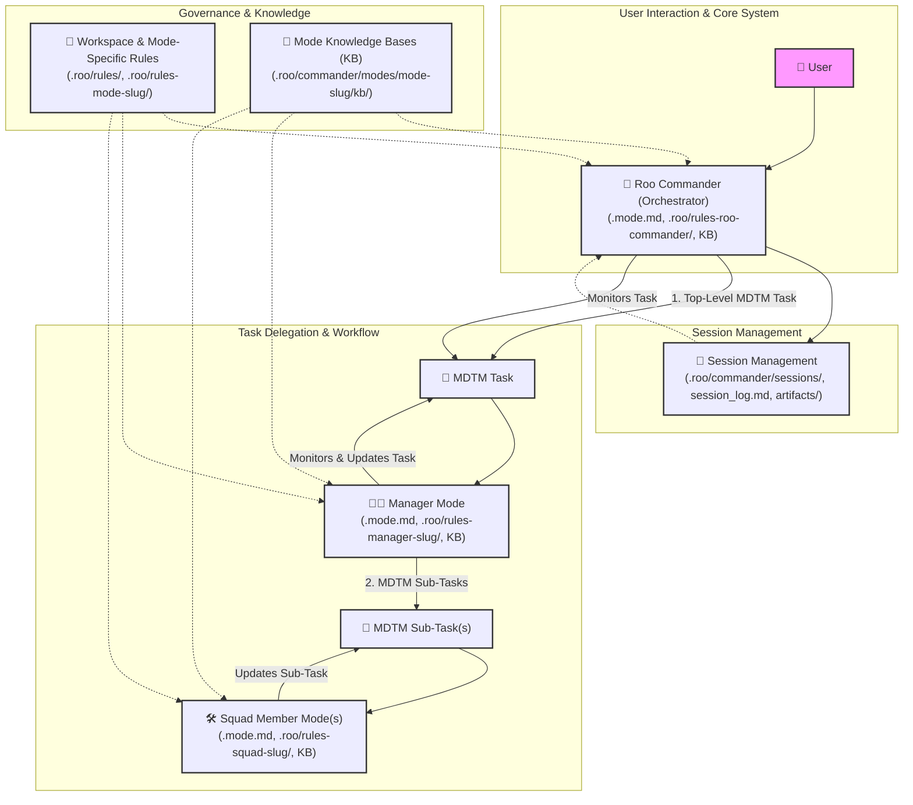

+++
# --- Basic Metadata ---
id = "ARCHITECTURE-DIRECTORY-README-V2" # Updated version
title = "Index: Roo Commander System Architecture"
context_type = "documentation_index"
scope = "Provides an overview and index of all documents detailing the system architecture of Roo Commander, including its core components, interaction patterns, and design principles."
target_audience = ["developers", "system_architects", "ai_modes_requiring_system_context"]
granularity = "index"
status = "active"
last_updated = "20250515"
version = "2.0" # Incremented due to structural updates and new content
tags = ["architecture", "index", "readme", "documentation", "system-design", "roo-commander"]
related_context = [
    ".roo/commander/docs/README.md", # Parent documentation index
    ".roo/commander/docs/introduction/README.md" # For high-level system purpose
]
template_schema_doc = ".roo/commander/templates/documentation/template_00_directory_readme.md" # Using our new directory readme template
# --- Directory Specific Fields (Optional) ---
# primary_artifact_type_contained = "Architectural Design Documents"
# key_subdirectories_summary = ["N/A - All files are at this level"]
+++

# Index: Roo Commander System Architecture

## 1. Purpose of this Directory

This directory, `[.roo/commander/docs/architecture/](.roo/commander/docs/architecture/)`, contains detailed documentation explaining the **system architecture of Roo Commander**. These documents describe the design principles, core components, their roles and responsibilities, interaction patterns, and the foundational systems (like MDTM, Sessions, Rules, and KBs) that underpin its operation.

Understanding this architecture is key for:
*   Developers maintaining or extending the Roo Commander system.
*   System architects evaluating or integrating with the system.
*   AI modes that need a deeper understanding of their operational context.

All path references within these documents adhere to the workspace-root-relative standard, starting with `.roo/`.

## 2. Conceptual System Overview Diagram

The Roo Commander system is built upon a hierarchical "Orchestrator -> Manager -> Squad" model, supported by standardized processes for task management, session context, rules, and knowledge.

*Diagram Key:*
*   Arrows (`-->`) indicate primary flow of command, delegation, or data.
*   Dotted arrows (`-.->`) indicate influence, consultation, or adherence.
*   Each mode type references its definition (`.mode.md`), its specific rules directory, and its Knowledge Base (KB).

## 3. Architectural Documents

The following documents provide detailed explanations of each core component and concept:

*   **`[01_orchestrator_role.md](./01_orchestrator_role.md)`**
    *   **Title:** Architecture: The Orchestrator (`roo-commander`) Role
    *   **Purpose:** Delves into the responsibilities and operation of `👑 Roo Commander`.

*   **`[02_manager_modes.md](./02_manager_modes.md)`**
    *   **Title:** Architecture: Manager Modes - Domain-Specific Orchestrators
    *   **Purpose:** Explains the role of Manager modes, using `🧑‍💼 Data Product Manager` as a primary example.

*   **`[03_squad_modes.md](./03_squad_modes.md)`**
    *   **Title:** Architecture: Squad Member Modes - Specialist Executors
    *   **Purpose:** Describes Squad Member modes and their function, detailing the `data-product-*` squad.

*   **`[04_mdtm_integration.md](./04_mdtm_integration.md)`**
    *   **Title:** Architecture: MDTM Integration - Delegation & Tracking Backbone
    *   **Purpose:** Provides details on how MDTM underpins the delegation and task management system.

*   **`[05_session_management_overview.md](./05_session_management_overview.md)`**
    *   **Title:** Architecture: Session Management & Artifacts - Context and Traceability
    *   **Purpose:** Explains the structure and importance of sessions, logs, and artifacts.

*   **`[06_knowledge_base_philosophy.md](./06_knowledge_base_philosophy.md)`**
    *   **Title:** Architecture: Knowledge Base (KB) Philosophy & Structure
    *   **Purpose:** Discusses the design and use of KBs for different mode archetypes and their role in supplementing mode rules.

*   **`[07_rules_system_architecture.md](./07_rules_system_architecture.md)` (NEW)**
    *   **Title:** Architecture: Rules System - Guiding AI Behavior
    *   **Purpose:** Explains the hierarchy and function of Workspace Rules and Mode-Specific Rules (`.roo/rules-[mode_slug]/`) in defining AI mode operational logic.

We recommend reading these documents in sequence for a comprehensive understanding, or navigating directly to the topic of interest.