+++
# --- Basic Metadata ---
id = "INTRODUCTION-DIRECTORY-README-V2" # Updated version
title = "Introduction to Roo Commander"
context_type = "documentation_index" # Also serves as an overview
scope = "Provides a high-level introduction to the Roo Commander system, its core philosophy, purpose, benefits, and guides users to more detailed introductory documents."
target_audience = ["all"] # New users, developers, system architects
granularity = "overview_and_index"
status = "active"
created_date = "20250515"
last_updated = "20250515"
version = "2.0" # Incremented due to significant content update
tags = ["introduction", "readme", "overview", "roo-commander", "architecture-summary", "getting-started"]
related_context = [
    ".roo/commander/docs/README.md", # Parent documentation index
    ".roo/commander/docs/introduction/01_purpose_and_goals.md",
    ".roo/commander/docs/introduction/02_key_benefits.md",
    ".roo/commander/docs/architecture/README.md" # For deeper architectural understanding
]
template_schema_doc = ".roo/commander/templates/documentation/template_00_directory_readme.md" # Using our directory readme template
# --- Directory Specific Fields (Optional) ---
# primary_artifact_type_contained = "Introductory Documents"
# key_subdirectories_summary = ["N/A - All files are at this level"]
+++

# Introduction to Roo Commander

## 1. Welcome to Roo Commander!

Welcome to Roo Commander, an intelligent workflow orchestration system designed to help you tackle complex projects by coordinating specialized AI agents in a structured, traceable, and efficient manner.

The primary goal of Roo Commander is to move beyond monolithic AI assistance towards a modular, hierarchical system where different AI "modes" take on distinct roles – from high-level coordination to domain-specific management and specialized task execution. This introduction will provide you with a high-level overview of its core philosophy and guide you to more detailed information.

All file path references within this documentation adhere to the workspace-root-relative standard, starting with `.roo/`.

## 2. The Core Philosophy: Orchestrator ➡️ Manager ➡️ Squad

Roo Commander is built upon a hierarchical **"Orchestrator -> Manager -> Squad"** model. This layered approach is designed for modularity, specialization, scalability, and clear delegation:

```mermaid
graph LR
    subgraph SystemCore["Roo Commander System"]
        direction LR
        A["👤 User"] --> B["👑 Roo Commander (Orchestrator)"];
        B -- "Delegates High-Level Goal (MDTM Task)" --> C["🧑‍💼 Manager Mode (Domain Orchestrator)"];
        C -- "Delegates Sub-Tasks (MDTM)" --> D["🛠️ Squad Member(s) (Specialist Executor)"];
        D -- "Produces Artifact(s)" --> C;
        C -- "Reports Completion & Final Artifact(s)" --> B;
        B -- "Manages Session & Reports to User" --> A;
    end

    style A fill:#f9f,stroke:#333,stroke-width:2px
    style B fill:#lightgrey,stroke:#333,stroke-width:2px
    style C fill:#lightgrey,stroke:#333,stroke-width:2px
    style D fill:#lightgrey,stroke:#333,stroke-width:2px
```

*   **The Orchestrator (`👑 Roo Commander` (`roo-commander`)):**
    *   The top-level, user-facing AI mode.
    *   Manages work **Sessions** (for context and traceability).
    *   Delegates broad objectives to appropriate "Manager" modes via **MDTM (Markdown-Driven Task Management) tasks**.
    *   Its detailed operational logic is defined in `[.roo/rules-roo-commander/](.roo/rules-roo-commander/)` and its Knowledge Base (KB) in `[.roo/commander/modes/roo-commander/kb/](.roo/commander/modes/roo-commander/kb/)`.

*   **Manager Modes (e.g., `🧑‍💼 Data Product Manager` (`manager-data-product`)):**
    *   Domain-specific orchestrators that receive a high-level MDTM task.
    *   Break down this task into a sequence of sub-tasks for their specialized "Squad" members.
    *   Manage the workflow and artifact flow within their squad.
    *   Their logic is in `[.roo/rules-[manager_slug]/](.roo/rules-[manager_slug]/)` and `[.roo/commander/modes/[manager_slug]/kb/](.roo/commander/modes/[manager_slug]/kb/)`.

*   **Squad Member Modes (e.g., `📊 Data Product Strategist` (`data-product-strategist`)):**
    *   Specialist worker AIs that perform specific, well-defined tasks assigned by their Manager.
    *   Typically produce a defined output artifact.
    *   Their logic is primarily driven by their MDTM task, supplemented by `[.roo/rules-[squad_member_slug]/](.roo/rules-[squad_member_slug]/)` and `[.roo/commander/modes/[squad_member_slug]/kb/](.roo/commander/modes/[squad_member_slug]/kb/)`.

This philosophy allows Roo Commander to handle complex projects with greater precision and modularity.

## 3. Initial Implementation: Data Product Design

The first full implementation of this "Orchestrator -> Manager -> Squad" philosophy within Roo Commander is the **Data Product Design PoC workflow**, orchestrated by the `🧑‍💼 Data Product Manager` (`manager-data-product`) mode and its dedicated squad. This capability guides users through a structured process to define and plan a Data Product Proof of Concept.

## 4. Navigating this Introduction

To learn more about Roo Commander, please explore the following documents in this section:

*   **`[01_purpose_and_goals.md](./01_purpose_and_goals.md)`**
    *   **Title:** Purpose and Goals of Roo Commander
    *   **Purpose:** Delves into the fundamental reasons why Roo Commander was created and the key objectives it aims to achieve.

*   **`[02_key_benefits.md](./02_key_benefits.md)`**
    *   **Title:** Key Benefits of Using Roo Commander
    *   **Purpose:** Highlights the main advantages that the Roo Commander system and its architecture offer to users and developers.

For a deeper dive into the system's components and how they interact, please refer to the [System Architecture documentation `[.roo/commander/docs/architecture/README.md](.roo/commander/docs/architecture/README.md)`).

## 5. Getting Started

Users typically start by interacting with `👑 Roo Commander` (`roo-commander`) to define their high-level goal. The system will then guide them through session creation and delegation to the appropriate Manager mode if necessary.