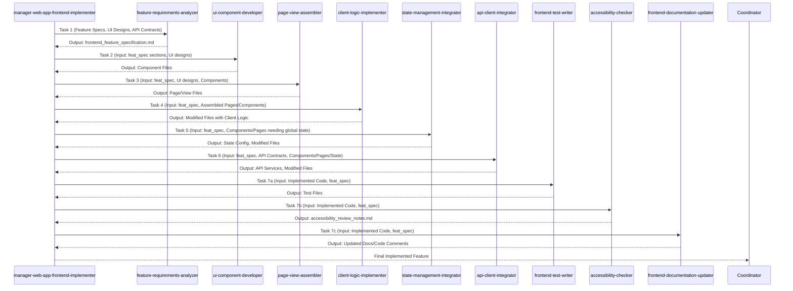

+++
# --- Squad Planning: Workflow & Artifact Flow ---
id = "SQUAD-WORKFLOW-FEIMPLEMENT-20250515"
title = "Squad Workflow & Artifact Flow: Frontend Implementation Squad"
status = "defined" # Finalizing this now
created_date = "20250515"
last_updated = "20250515T00:00:00Z" # Reflects this finalization
version = "1.0"
tags = ["squad-planning", "workflow-design", "artifact-flow", "orchestration-planning", "frontend-implementation-squad", "web-development"]
template_schema_doc = ".roo/commander/templates/planning/squad_design/template_02_squad_workflow_and_artifact_flow.README.md"

# --- Squad & Workflow Identification ---
squad_unit_name_ref = "Frontend Implementation Squad"
squad_concept_doc_id = "SQUAD-CONCEPT-FEIMPLEMENT-20250515"
managing_mode_slug_ref = "manager-web-app-frontend-implementer"

workflow_name = "Standard Frontend Feature Implementation Workflow"
workflow_version = "1.0"
estimated_total_phases = 7 # Based on the core sequence of squad members

# --- Key Workflow Characteristics ---
overall_workflow_objective = "To take detailed feature specifications, UI designs, and API contracts, and implement fully functional, tested, accessible, and documented frontend features within a new or existing web application codebase."
key_input_to_workflow_start = "An MDTM task assigned to `manager-web-app-frontend-implementer` detailing a specific frontend feature to be implemented, along with paths to UI designs/mockups, user stories, and API contracts."
final_output_of_workflow = "Integrated and functional frontend feature code within the target project, accompanied by unit/integration tests, accessibility review notes, and updated documentation."
+++

# Squad Workflow & Artifact Flow: {{ squad_unit_name_ref }}

## 1. Overview 🗺️

*   **Workflow Name:** `{{ workflow_name }}`
*   **Squad Unit:** `{{ squad_unit_name_ref }}`
*   **Managing Mode:** `{{ managing_mode_slug_ref }}` (`🎨 Frontend Implementation Manager`)
*   **Purpose of this Document:** To define the typical sequential operational flow for the `{{ squad_unit_name_ref }}` when tasked with implementing a new frontend feature. This includes identifying each phase, the responsible squad member, their key inputs, and primary outputs. This guides the orchestration logic of `{{ managing_mode_slug_ref }}`.

## 2. Overall Workflow Objective 🎯

*   `{{ overall_workflow_objective }}`

## 3. Sequential Phase Breakdown & Artifact Flow 🔄

*(All artifact paths are conceptual target locations, typically within an existing project structure provided to the Manager, or within a session's artifacts if outputs are reports. The Manager will construct precise paths for MDTM sub-tasks.)*

---
### **Phase 1: Feature Requirements Analysis**

*   **Responsible Squad Member (Slug):** `feature-requirements-analyzer`
    *   *(Role: Analyzes feature specs, UI designs, API contracts to produce actionable frontend tasks.)*
*   **Input Artifact(s) for this Phase:**
    *   "Detailed feature requirements/user story (from Manager's MDTM task)."
    *   "UI/UX design mockups/wireframes (paths provided by Manager)."
    *   "API contract specifications (paths provided by Manager)."
    *   "Path to existing project codebase (if applicable)."
*   **Key Activities / Purpose of this Phase:**
    *   "Decompose feature into UI components, client-side logic, data needs."
    *   "Identify interactions and dependencies."
*   **Primary Output Artifact(s) from this Phase:**
    *   `frontend_feature_specification_v1.md`
        *   *Conceptual Target Path:* `[ActiveSessionPath]/artifacts/planning_outputs/[FeatureName]/frontend_feature_specification_v1.md`
        *   *Template Used:* `[.roo/commander/templates/design_artifacts/web_app_dev/template_frontend_feature_specification.md]`

---
### **Phase 2: UI Component Development**

*   **Responsible Squad Member (Slug):** `ui-component-developer`
    *   *(Role: Develops individual, reusable UI components.)*
*   **Input Artifact(s) for this Phase:**
    *   `frontend_feature_specification_v1.md` (from Phase 1 - specifically component specs).
    *   "UI mockups/designs for specific components."
    *   "Project's tech stack (framework, UI library, styling) and path to codebase."
*   **Key Activities / Purpose of this Phase:**
    *   "Implement individual UI components with structure, styling, and basic interactivity."
*   **Primary Output Artifact(s) from this Phase:**
    *   Set of component code files (e.g., `Button.jsx`, `UserProfileCard.vue`)
        *   *Conceptual Target Path:* `[ProjectPath]/src/components/[FeatureName]/` (or framework equivalent)

---
### **Phase 3: Page/View Assembly**

*   **Responsible Squad Member (Slug):** `page-view-assembler`
    *   *(Role: Assembles pages/views by integrating multiple UI components.)*
*   **Input Artifact(s) for this Phase:**
    *   `frontend_feature_specification_v1.md` (for page structure).
    *   "UI mockups for full pages/views."
    *   "Paths to developed UI components (from Phase 2)."
    *   "Project's tech stack and path to codebase."
*   **Key Activities / Purpose of this Phase:**
    *   "Create page-level components/templates."
    *   "Import and arrange UI components to form complete pages/views."
*   **Primary Output Artifact(s) from this Phase:**
    *   Page/View component files (e.g., `ProfilePage.jsx`, `ProductListingView.vue`)
        *   *Conceptual Target Path:* `[ProjectPath]/src/pages/` or `[ProjectPath]/src/views/` (or framework equivalent)

---
### **Phase 4: Client Logic Implementation**

*   **Responsible Squad Member (Slug):** `client-logic-implementer`
    *   *(Role: Implements client-side JS/TS logic for interactions, event handling, local state.)*
*   **Input Artifact(s) for this Phase:**
    *   `frontend_feature_specification_v1.md` (for interaction logic requirements).
    *   "Assembled page/view files (from Phase 3) and component files (from Phase 2)."
    *   "Project's tech stack and path to codebase."
*   **Key Activities / Purpose of this Phase:**
    *   "Add event handlers, conditional rendering, client-side validation, local state management."
*   **Primary Output Artifact(s) from this Phase:**
    *   Modified component and page files with implemented client-side logic.

---
### **Phase 5: State Management Integration (If Global/Shared State is Required)**

*   **Responsible Squad Member (Slug):** `state-management-integrator`
    *   *(Role: Sets up/integrates global state solutions like Redux, Zustand, Pinia.)*
*   **Input Artifact(s) for this Phase:**
    *   `frontend_feature_specification_v1.md` (for shared data requirements).
    *   "Project's tech stack (including chosen state library)."
    *   "Relevant component/page files that need to connect to global state."
*   **Key Activities / Purpose of this Phase:**
    *   "Set up store, define state structure, actions/reducers/mutations."
    *   "Connect components to the store."
*   **Primary Output Artifact(s) from this Phase:**
    *   State management configuration files (e.g., `store.js`, `userSlice.js`).
    *   Modified components connected to the store.

---
### **Phase 6: API Client Integration (If Backend Interaction is Required)**

*   **Responsible Squad Member (Slug):** `api-client-integrator`
    *   *(Role: Implements client-side logic to fetch/send data to backend APIs.)*
*   **Input Artifact(s) for this Phase:**
    *   `frontend_feature_specification_v1.md` (for data fetching/submission needs).
    *   "API contract specifications."
    *   "Relevant component/page/state files."
*   **Key Activities / Purpose of this Phase:**
    *   "Create API service modules."
    *   "Implement data fetching/submission logic, handle responses/errors, manage loading states."
    *   "Integrate API calls into components or state management actions."
*   **Primary Output Artifact(s) from this Phase:**
    *   API service modules.
    *   Modified components/state logic that interact with APIs.

---
### **Phase 7: Frontend Testing, Accessibility Check, & Documentation Update (Can run partially in parallel or sequentially after core implementation)**

*   **Responsible Squad Members (Can be multiple concurrent tasks managed by the Manager):**
    *   `frontend-test-writer`
    *   `accessibility-checker`
    *   `frontend-documentation-updater`
*   **Input Artifact(s) for this Phase:**
    *   Implemented feature code (components, pages, logic, state, API integrations).
    *   `frontend_feature_specification_v1.md`.
    *   Project's testing framework and documentation standards.
*   **Key Activities / Purpose of this Phase:**
    *   `frontend-test-writer`: "Write unit and integration tests."
    *   `accessibility-checker`: "Review code for basic accessibility issues."
    *   `frontend-documentation-updater`: "Add/update JSDoc, Storybook stories, or Markdown docs."
*   **Primary Output Artifact(s) from this Phase:**
    *   Test files (`*.test.js`, `*.spec.ts`).
    *   `accessibility_review_notes_v1.md`.
    *   Updated code with inline docs, new/updated Storybook files, or updated `.md` docs.

---

## 4. Visual Workflow & Artifact Flow Diagram (Conceptual) 📊

*(Note: Phase 7 (Testing, A11y, Docs) can often be initiated once core components and logic from phases 2-6 are stable for a feature, and may involve iteration.)*

## 5. Key Dependencies & Handoff Points 🔗

*   The `frontend_feature_specification_md` from `feature-requirements-analyzer` is a critical input for most subsequent phases.
*   Clear API contracts are essential for `api-client-integrator`.
*   The Manager (`{{ managing_mode_slug_ref }}`) plays a crucial role in sequencing these specialists and ensuring that the outputs of one phase (e.g., component files) are correctly passed as inputs to the next (e.g., to the page assembler).
*   The final testing, accessibility, and documentation phases depend on the completion of the core implementation work.

## 6. Considerations for the Managing Mode (`{{ managing_mode_slug_ref }}`) 🧠

*   The `{{ managing_mode_slug_ref }}`'s main KB procedure will detail this workflow, including logic for handling optional phases (e.g., if no global state is needed for a simple feature, `state-management-integrator` might be skipped).
*   It will need to create highly detailed MDTM sub-tasks for each specialist, providing precise paths to input code files and specifications.
*   It must manage potential iterations, e.g., if `accessibility-checker` finds issues, the Manager might create a new task for `ui-component-developer` to remediate.

This document provides the blueprint for the operational sequence of the `{{ squad_unit_name_ref }}`.