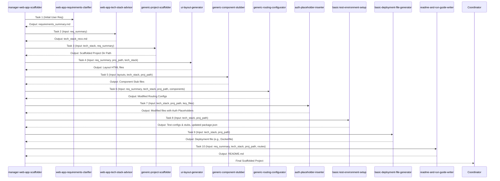

+++
# --- Squad Planning: Workflow & Artifact Flow ---
id = "SQUAD-WORKFLOW-WEBAPPSCAFFOLD-20250515"
title = "Squad Workflow & Artifact Flow: Web App Scaffolding Squad"
status = "defined" # Finalizing this now
created_date = "20250515"
last_updated = "20250515T00:00:00Z" # Reflects this finalization
version = "1.0"
tags = ["squad-planning", "workflow-design", "artifact-flow", "orchestration-planning", "web-app-scaffolding-squad"]
template_schema_doc = ".roo/commander/templates/planning/squad_design/template_02_squad_workflow_and_artifact_flow.README.md"

# --- Squad & Workflow Identification ---
squad_unit_name_ref = "Web App Scaffolding Squad"
squad_concept_doc_id = "SQUAD-CONCEPT-WEBAPPSCAFFOLD-20250515"
managing_mode_slug_ref = "manager-web-app-scaffolder"

workflow_name = "Standard Web Application Scaffolding Workflow"
workflow_version = "1.0"
estimated_total_phases = 10 # Based on our 10 squad members in sequence

# --- Key Workflow Characteristics ---
overall_workflow_objective = "To rapidly generate a runnable, well-structured starter codebase for a new web application, including project setup, basic UI layout, component stubs, routing, initial documentation, testing stubs, auth placeholders, and basic deployment files."
key_input_to_workflow_start = "An initial user request or project idea for a web application, passed via an MDTM task to `manager-web-app-scaffolder`."
final_output_of_workflow = "A scaffolded web application codebase directory within the session artifacts, including a `README.md` and all generated configuration and stub files."
+++

# Squad Workflow & Artifact Flow: {{ squad_unit_name_ref }}

## 1. Overview 🗺️

*   **Workflow Name:** `{{ workflow_name }}`
*   **Squad Unit:** `{{ squad_unit_name_ref }}`
*   **Managing Mode (Conceptual):** `{{ managing_mode_slug_ref }}`
*   **Purpose of this Document:** To define the sequential operational flow for the `{{ squad_unit_name_ref }}`. This includes identifying each phase of work, the responsible squad member (by slug) for that phase, the key input artifacts they require, and the primary output artifacts they produce. This document is essential for designing the main orchestration procedure of the `{{ managing_mode_slug_ref }}`.

## 2. Overall Workflow Objective 🎯

*   `{{ overall_workflow_objective }}`

## 3. Sequential Phase Breakdown & Artifact Flow 🔄

*(All artifact paths are conceptual target locations within a session, e.g., `[.roo/commander/sessions/[SESSION_ID]/artifacts/planning_outputs/[ProjectName]/[filename]]` or `[.roo/commander/sessions/[SESSION_ID]/artifacts/scaffolds/[ProjectName]/[filename]]`. The Manager will construct precise paths.)*

---
### **Phase 1: Requirements Clarification**

*   **Responsible Squad Member (Slug):** `web-app-requirements-clarifier`
    *   *(Role: Elicits core pages/views, essential high-level functionalities (stubs), and overall style.)*
*   **Input Artifact(s) for this Phase:**
    *   "Initial user request/project idea (from Manager's MDTM task)."
    *   "Active Session ID and Path for context."
*   **Key Activities / Purpose of this Phase:**
    *   "Analyze initial request, formulate clarifying questions (via Manager)."
    *   "Elicit core pages/views, essential features (stubs), style preferences, core data entities (names only)."
*   **Primary Output Artifact(s) from this Phase:**
    *   `requirements_summary_scaffold_v1.md`
        *   *Conceptual Target Path:* `[ActiveSessionPath]/artifacts/planning_outputs/[ProjectName]/requirements_summary_scaffold_v1.md`
        *   *Template Used:* `[.roo/commander/templates/design_artifacts/web_app_dev/template_scaffold_requirements_summary.md]` (to be created)

---
### **Phase 2: Technology Stack Advisement**

*   **Responsible Squad Member (Slug):** `web-app-tech-stack-advisor`
    *   *(Role: Advises on suitable frontend frameworks, backend approaches, UI libraries, BaaS options.)*
*   **Input Artifact(s) for this Phase:**
    *   `requirements_summary_scaffold_v1.md` (from Phase 1).
    *   "(Optional) User's pre-stated technology preferences."
*   **Key Activities / Purpose of this Phase:**
    *   "Analyze requirements and preferences."
    *   "Consult KB for framework/library options and trade-offs."
    *   "Present options (via Manager if needed) and finalize recommended stack."
*   **Primary Output Artifact(s) from this Phase:**
    *   `tech_stack_recommendation_v1.md`
        *   *Conceptual Target Path:* `[ActiveSessionPath]/artifacts/planning_outputs/[ProjectName]/tech_stack_recommendation_v1.md`
        *   *Template Used:* `[.roo/commander/templates/design_artifacts/web_app_dev/template_tech_stack_recommendation.md]` (to be created)

---
### **Phase 3: Generic Project Scaffolding**

*   **Responsible Squad Member (Slug):** `generic-project-scaffolder`
    *   *(Role: Sets up initial project structure, build configs, essential dependencies, `.env.example`.)*
*   **Input Artifact(s) for this Phase:**
    *   `tech_stack_recommendation_v1.md` (from Phase 2).
    *   `requirements_summary_scaffold_v1.md` (for project name, context).
*   **Key Activities / Purpose of this Phase:**
    *   "Consult KB for chosen framework's scaffolding procedure."
    *   "Create project directory, standard config files (`package.json`, `tsconfig.json`, etc.), framework-specific configs, and base directory structure."
*   **Primary Output Artifact(s) from this Phase:**
    *   Scaffolded Project Directory (e.g., `[ActiveSessionPath]/artifacts/scaffolds/[ProjectName]/`)
    *   Key files like `package.json`, `[framework].config.js`, `.env.example` within the scaffold.
    *   Scaffolding Status Report (textual log or simple `.md` note).

---
### **Phase 4: UI Layout Generation**

*   **Responsible Squad Member (Slug):** `ui-layout-generator`
    *   *(Role: Generates basic HTML/CSS (e.g., Tailwind) for key page layouts with placeholders.)*
*   **Input Artifact(s) for this Phase:**
    *   `requirements_summary_scaffold_v1.md` (for key pages/views, style).
    *   Path to Scaffolded Project Directory (from Phase 3).
    *   `tech_stack_recommendation_v1.md` (for chosen CSS utility/framework).
*   **Key Activities / Purpose of this Phase:**
    *   "For each key page, generate HTML structure and apply utility CSS for layout."
    *   "Include placeholders for future components."
*   **Primary Output Artifact(s) from this Phase:**
    *   Set of HTML/layout files (e.g., `home_layout.html`, `dashboard_layout.html`)
        *   *Conceptual Target Path:* `[ProjectPath]/src/layouts/` (or framework equivalent)

---
### **Phase 5: Generic Component Stubbing**

*   **Responsible Squad Member (Slug):** `generic-component-stubber`
    *   *(Role: Creates placeholder component files for chosen framework with minimal boilerplate.)*
*   **Input Artifact(s) for this Phase:**
    *   UI Layout files (from Phase 4).
    *   `tech_stack_recommendation_v1.md` (for chosen frontend framework).
    *   Path to Scaffolded Project Directory.
*   **Key Activities / Purpose of this Phase:**
    *   "Analyze layouts to identify components."
    *   "Consult KB for framework-specific component boilerplate."
    *   "Create empty/stub component files (e.g., `.jsx`, `.vue`) in appropriate project directories."
*   **Primary Output Artifact(s) from this Phase:**
    *   Set of new component files (e.g., `UserProfile.jsx`, `ProductCard.vue`)
        *   *Conceptual Target Path:* `[ProjectPath]/src/components/` (or framework equivalent)

---
### **Phase 6: Generic Routing Configuration**

*   **Responsible Squad Member (Slug):** `generic-routing-configurator`
    *   *(Role: Configures basic page routing for chosen framework.)*
*   **Input Artifact(s) for this Phase:**
    *   `requirements_summary_scaffold_v1.md` (for list of pages).
    *   `tech_stack_recommendation_v1.md` (for framework).
    *   Path to Scaffolded Project Directory.
    *   List of component files/paths (from Phase 5).
*   **Key Activities / Purpose of this Phase:**
    *   "Consult KB for framework's routing mechanism."
    *   "Define routes for key pages, linking to stubbed components."
    *   "Modify/create framework routing files."
*   **Primary Output Artifact(s) from this Phase:**
    *   Modified/created routing configuration files within the project.

---
### **Phase 7: Auth Placeholder Insertion**

*   **Responsible Squad Member (Slug):** `auth-placeholder-inserter`
    *   *(Role: Adds comments/stubs for integrating a chosen auth method.)*
*   **Input Artifact(s) for this Phase:**
    *   `tech_stack_recommendation_v1.md` (for chosen auth provider, if any).
    *   Path to Scaffolded Project Directory.
    *   Paths to key files (e.g., root layout, example API route).
*   **Key Activities / Purpose of this Phase:**
    *   "Consult KB for auth provider integration points."
    *   "Add comments/stubs in relevant files for auth SDK init, UI elements, route protection."
    *   "Update/create `.env.example` with auth-related placeholders."
*   **Primary Output Artifact(s) from this Phase:**
    *   Modified project files with auth placeholders.

---
### **Phase 8: Basic Test Environment Setup**

*   **Responsible Squad Member (Slug):** `basic-test-environment-setup`
    *   *(Role: Sets up testing framework config and example empty test files.)*
*   **Input Artifact(s) for this Phase:**
    *   `tech_stack_recommendation_v1.md` (for framework context).
    *   Path to Scaffolded Project Directory.
*   **Key Activities / Purpose of this Phase:**
    *   "Consult KB for testing setup for the chosen stack."
    *   "Add test dependencies to `package.json`."
    *   "Create test config files and example empty test files."
    *   "Add test scripts to `package.json`."
*   **Primary Output Artifact(s) from this Phase:**
    *   Modified `package.json`, new test config files, example test files.

---
### **Phase 9: Basic Deployment File Generation**

*   **Responsible Squad Member (Slug):** `basic-deployment-file-generator`
    *   *(Role: Creates a minimal Dockerfile or static host config.)*
*   **Input Artifact(s) for this Phase:**
    *   `tech_stack_recommendation_v1.md` (for framework context).
    *   Path to Scaffolded Project Directory.
    *   (Optional) User preference for deployment target.
*   **Key Activities / Purpose of this Phase:**
    *   "Consult KB for deployment patterns for the stack/target."
    *   "Generate `Dockerfile` or platform-specific config (e.g., `vercel.json`)."
*   **Primary Output Artifact(s) from this Phase:**
    *   Deployment configuration file (e.g., `Dockerfile`) in project root.

---
### **Phase 10: README & Run Guide Writing**

*   **Responsible Squad Member (Slug):** `readme-and-run-guide-writer`
    *   *(Role: Generates a basic `README.md` with project overview, setup, and run instructions.)*
*   **Input Artifact(s) for this Phase:**
    *   `requirements_summary_scaffold_v1.md` (for project purpose).
    *   `tech_stack_recommendation_v1.md` (for framework run commands).
    *   Path to Scaffolded Project Directory.
    *   (Optional) List of key routes from `generic-routing-configurator`.
*   **Key Activities / Purpose of this Phase:**
    *   "Consult KB for README structure for the framework."
    *   "Populate README with project title, description, setup, run commands, basic structure overview."
*   **Primary Output Artifact(s) from this Phase:**
    *   `README.md`
        *   *Conceptual Target Path:* `[ProjectPath]/README.md`
        *   *Template Used:* `[.roo/commander/templates/project_root/template_README_scaffolded_app.md]` (to be created)

---

## 4. Visual Workflow & Artifact Flow Diagram (Conceptual) 📊

## 5. Key Dependencies & Handoff Points 🔗

*   The entire workflow is highly sequential, with the output of one phase being a critical input for the next.
*   `tech_stack_recommendation_v1.md` is a pivotal artifact influencing many subsequent steps.
*   The `Scaffolded Project Directory Path` created by `generic-project-scaffolder` becomes the working context for most subsequent file-creating modes.
*   Clear definition of output file paths and structures in each MDTM sub-task by `manager-web-app-scaffolder` is crucial.

## 6. Considerations for the Managing Mode (`{{ managing_mode_slug_ref }}`) 🧠

*   The `{{ managing_mode_slug_ref }}`'s main KB procedure (`01-main-orchestration-flow.md`) will meticulously detail this 10-phase sequence.
*   It must carefully manage the `input_artifacts` and `output_artifacts` for each MDTM sub-task, ensuring correct `.roo/` anchored paths are used.
*   It needs to handle potential user interaction (via `👑 Roo Commander`) during the Requirements Clarification and Tech Stack Advisement phases.
*   Error handling at each phase is important; if a phase fails, subsequent phases may not be able to proceed.

This document provides the blueprint for the operational sequence of the `{{ squad_unit_name_ref }}`.