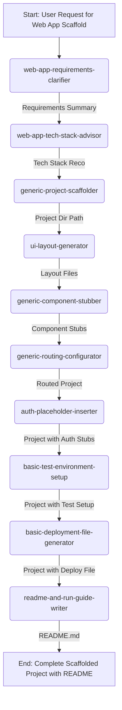

+++
# --- Squad Planning: Design Summary & Blueprint ---
id = "SQUAD-BLUEPRINT-WEBAPPSCAFFOLD-20250515"
title = "Squad Design Summary & Blueprint: Web App Scaffolding Squad"
status = "defined" # As we are finalizing it now
created_date = "20250515"
last_updated = "20250515T00:00:00Z" # Reflects this finalization
version = "1.0"
tags = ["squad-planning", "design-summary", "blueprint", "orchestration-design", "web-app-scaffolding-squad", "web-development"]
template_schema_doc = ".roo/commander/templates/planning/squad_design/template_04_squad_design_summary_and_blueprint.README.md"

# --- Squad & Blueprint Identification ---
squad_unit_name = "Web App Scaffolding Squad"
proposed_managing_mode_slug = "manager-web-app-scaffolder"
version_of_planning_inputs = "1.0" # Assuming all input planning docs are v1.0

# --- Links to Detailed Planning Documents (CRITICAL - MUST be .roo/ anchored paths) ---
linked_squad_concept_doc = ".roo/commander/planning/squad_designs/web_app_scaffolding_squad/00_concept_mission_web_app_scaffolding_squad.md"
linked_squad_member_role_docs = [
    ".roo/commander/planning/squad_designs/web_app_scaffolding_squad/01_role_web_app_requirements_clarifier.md",
    ".roo/commander/planning/squad_designs/web_app_scaffolding_squad/01_role_web_app_tech_stack_advisor.md",
    ".roo/commander/planning/squad_designs/web_app_scaffolding_squad/01_role_generic_project_scaffolder.md",
    ".roo/commander/planning/squad_designs/web_app_scaffolding_squad/01_role_ui_layout_generator.md",
    ".roo/commander/planning/squad_designs/web_app_scaffolding_squad/01_role_generic_component_stubber.md",
    ".roo/commander/planning/squad_designs/web_app_scaffolding_squad/01_role_generic_routing_configurator.md",
    ".roo/commander/planning/squad_designs/web_app_scaffolding_squad/01_role_auth_placeholder_inserter.md",
    ".roo/commander/planning/squad_designs/web_app_scaffolding_squad/01_role_basic_test_environment_setup.md",
    ".roo/commander/planning/squad_designs/web_app_scaffolding_squad/01_role_basic_deployment_file_generator.md",
    ".roo/commander/planning/squad_designs/web_app_scaffolding_squad/01_role_readme_and_run_guide_writer.md"
]
linked_workflow_doc = ".roo/commander/planning/squad_designs/web_app_scaffolding_squad/02_workflow_web_app_scaffolding_squad.md"
linked_research_plan_doc = ".roo/commander/planning/squad_designs/web_app_scaffolding_squad/03_research_plan_web_app_scaffolding_squad.md"

# --- Key Summary Points (Extracted - details in linked docs) ---
overall_mission_summary = "To provide a comprehensive, AI-assisted service for rapidly generating well-structured and runnable starter projects for new web applications, guiding users from high-level requirements to a foundational codebase ready for immediate further development."
number_of_squad_members = 10
key_workflow_output = "A functional, scaffolded web application codebase (for a user-selected or advised framework) including: project structure, build configurations, essential dependencies (via package.json), basic UI page layouts, placeholder components, initial routing, testing environment setup stubs, basic deployment file (e.g., Dockerfile), and a `README.md` with setup and run instructions."
primary_research_focus_areas = [
    "Framework-Specific Project Initialization & Scaffolding (CLI commands, directory structures, core configs for various frameworks)",
    "HTML/CSS Layout Generation (especially with Tailwind CSS)",
    "Framework-Specific Component Stubbing Boilerplate",
    "Framework-Specific Routing Configuration",
    "Auth Integration Patterns (Placeholders)",
    "Testing Framework Setup (Jest, Vitest, Playwright basics)",
    "Basic Dockerfile & Static Host Configuration Patterns"
]
+++

# Squad Design Summary & Blueprint: {{ squad_unit_name }}

## 1. Overview & Purpose of this Blueprint 📜

*   **Squad Unit:** `{{ squad_unit_name }}`
*   **Proposed Managing Mode:** `{{ proposed_managing_mode_slug }}` (`🏗️ Web App Scaffolder Manager`)
*   **Purpose:** This document serves as a consolidated summary and final blueprint for the design of the `{{ squad_unit_name }}`. It synthesizes key information from the detailed planning documents listed below.
*   **Next Step:** Upon approval, this blueprint guides the actual development of the `{{ proposed_managing_mode_slug }}` mode, its 10 Squad Member modes, their respective rules in `[.roo/rules-[mode_slug]/]`, and their Knowledge Bases in `[.roo/commander/modes/[mode_slug]/kb/]`.

## 2. Links to Detailed Planning Documents 🔗

This summary is based on the following detailed planning documents. These documents contain the full specifications and **MUST** be consulted for complete details. All paths are workspace-root-relative.

*   **Squad Concept & Mission:** `{{ linked_squad_concept_doc }}`
*   **Squad Member Role Definitions:**
    *   `[.roo/commander/planning/squad_designs/web_app_scaffolding_squad/01_role_web_app_requirements_clarifier.md]`
    *   `[.roo/commander/planning/squad_designs/web_app_scaffolding_squad/01_role_web_app_tech_stack_advisor.md]`
    *   `[.roo/commander/planning/squad_designs/web_app_scaffolding_squad/01_role_generic_project_scaffolder.md]`
    *   `[.roo/commander/planning/squad_designs/web_app_scaffolding_squad/01_role_ui_layout_generator.md]`
    *   `[.roo/commander/planning/squad_designs/web_app_scaffolding_squad/01_role_generic_component_stubber.md]`
    *   `[.roo/commander/planning/squad_designs/web_app_scaffolding_squad/01_role_generic_routing_configurator.md]`
    *   `[.roo/commander/planning/squad_designs/web_app_scaffolding_squad/01_role_auth_placeholder_inserter.md]`
    *   `[.roo/commander/planning/squad_designs/web_app_scaffolding_squad/01_role_basic_test_environment_setup.md]`
    *   `[.roo/commander/planning/squad_designs/web_app_scaffolding_squad/01_role_basic_deployment_file_generator.md]`
    *   `[.roo/commander/planning/squad_designs/web_app_scaffolding_squad/01_role_readme_and_run_guide_writer.md]`
*   **Squad Workflow & Artifact Flow:** `{{ linked_workflow_doc }}`
*   **Squad Knowledge & Research Plan:** `{{ linked_research_plan_doc }}`

## 3. Executive Summary of the Squad Unit 🚀

### 3.1. Mission & Value Proposition
*   `{{ overall_mission_summary }}`
*   The primary value is to dramatically accelerate the start of new web projects by automating the creation of a robust, conventional, and runnable foundational codebase.

### 3.2. Primary Output / Deliverable of the Squad's Workflow
*   `{{ key_workflow_output }}`

## 4. Squad Composition Summary 🧑‍🤝‍🧑

| Proposed Mode Name                             | Proposed Slug                         | Core Responsibility within Squad Workflow                                                                                                | Primary Output Artifact Type(s)                                                                                             |
|------------------------------------------------|---------------------------------------|------------------------------------------------------------------------------------------------------------------------------------------|-----------------------------------------------------------------------------------------------------------------------------|
| 🗣️ Web App Requirements Clarifier              | `web-app-requirements-clarifier`      | Elicits core pages/views, essential high-level functionalities (stubs), and overall style for the scaffold.                                | `requirements_summary_scaffold_v1.md`                                                                                       |
| 🧐 Web App Tech Stack Advisor                  | `web-app-tech-stack-advisor`          | Advises on/confirms suitable frontend frameworks, backend approaches, UI libraries, BaaS options for the scaffold.                       | `tech_stack_recommendation_v1.md`                                                                                           |
| 🏗️ Generic Project Scaffolder                  | `generic-project-scaffolder`          | Sets up initial project structure, build configs, essential dependencies, `.env.example` for the chosen stack (KB-driven).                 | Scaffolded project directory & core config files.                                                                           |
| 🖼️ UI Layout Generator                         | `ui-layout-generator`                 | Generates basic HTML/CSS (e.g., Tailwind) for key page layouts with placeholders.                                                        | HTML/CSS layout files/snippets.                                                                                             |
| 🧩 Generic Component Stubber                   | `generic-component-stubber`           | Creates placeholder component files (e.g., `.jsx`, `.vue`) within the scaffold, based on layouts and chosen framework (KB-driven).       | Empty/boilerplate component files.                                                                                          |
| 🗺️ Generic Routing Configurator                | `generic-routing-configurator`        | Configures basic page routing for the chosen framework, making stubbed pages navigable (KB-driven).                                        | Modified/created routing configuration files.                                                                               |
| 🛡️ Auth Placeholder Inserter                   | `auth-placeholder-inserter`           | Adds comments, code stubs, and example environment variables to guide future integration of a chosen authentication method.            | Modified project files with auth placeholders.                                                                              |
| 🧪 Basic Test Environment Setup Specialist     | `basic-test-environment-setup`        | Sets up a basic testing framework (e.g., Jest, Vitest) including initial configuration and example empty test files.                   | Modified `package.json`, test config files, example test files.                                                             |
| 🚀 Basic Deployment File Generator             | `basic-deployment-file-generator`     | Generates a minimal, common deployment configuration file (e.g., Dockerfile, Vercel/Netlify config) for the scaffold.                | Deployment configuration file (e.g., `Dockerfile`).                                                                         |
| 📖 README & Run Guide Writer                   | `readme-and-run-guide-writer`         | Generates a basic `README.md` for the scaffolded project, including overview, setup instructions, and how to run the dev server.       | `README.md` file.                                                                                                           |

*   **Total Squad Members Proposed:** `{{ number_of_squad_members }}`

## 5. Workflow & Artifact Flow Overview 🔄

The squad operates in a sequential pipeline, managed by `{{ proposed_managing_mode_slug }}`. Each member takes inputs from previous members (or initial requirements) and produces artifacts that feed into subsequent steps, culminating in a complete project scaffold. The detailed flow is documented in `{{ linked_workflow_doc }}`.

**Visual Flow (High-Level - Refer to detailed diagram in `{{ linked_workflow_doc }}`):**

## 6. Key Knowledge & Research Requirements Summary 📚

The effectiveness of this squad, particularly its "generic" members, relies on comprehensive KBs detailing procedures for various frameworks and tools. Key research areas (detailed in `{{ linked_research_plan_doc }}`) include:
*   `{{ primary_research_focus_areas[0] }}`
*   `{{ primary_research_focus_areas[1] }}`
*   `{{ primary_research_focus_areas[2] }}`
*   `{{ primary_research_focus_areas[3] }}`
*   `{{ primary_research_focus_areas[4] }}`
*   `{{ primary_research_focus_areas[5] }}`
*   `{{ primary_research_focus_areas[6] }}`
*   Initial KBs will need to be populated for common stacks (e.g., Next.js/React, Vite/Vue, SvelteKit, Astro for frontend; Jest/Vitest/Playwright for testing; Docker/Vercel/Netlify for deployment).

## 7. Proposed Next Steps for Development 🛠️

1.  **Architectural Review and Approval:** Finalize and approve this Squad Design Blueprint.
2.  **Manager Mode Definition:** Create the `.mode.md`, rules, and initial KB (README, main orchestration procedure, squad composition reference) for `{{ proposed_managing_mode_slug }}`.
3.  **Squad Member Mode Definitions:** For each of the 10 squad members listed:
    *   Create their `.mode.md` file using `[.roo/commander/templates/modes/squad/template_00_squad.mode.md]`, populating from their respective Role Definition documents.
    *   Create their `[.roo/rules-[slug]/00-[slug]-core-principles.md]` file.
4.  **KB Bootstrapping:** Begin populating the KBs for the generic specialists (`generic-project-scaffolder`, `generic-component-stubber`, `generic-routing-configurator`, `basic-test-environment-setup`, `basic-deployment-file-generator`, `auth-placeholder-inserter`) with procedures and reference material for 1-2 initial target frameworks/tools, based on the Research Plan. This will be an ongoing task for `meta-kb-editor`.
5.  **Template Creation:** Design and create the new templates identified:
    *   `[.roo/commander/templates/design_artifacts/web_app_dev/template_scaffold_requirements_summary.md]`
    *   `[.roo/commander/templates/design_artifacts/web_app_dev/template_tech_stack_recommendation.md]`
    *   `[.roo/commander/templates/project_root/template_README_scaffolded_app.md]`
6.  **Integration:** Update `👑 Roo Commander`'s KB to make `{{ proposed_managing_mode_slug }}` available.
7.  **Iterative Testing:** Conduct end-to-end testing of the scaffolding workflow for an initial target stack.

This blueprint provides a comprehensive plan for developing the `{{ squad_unit_name }}`.