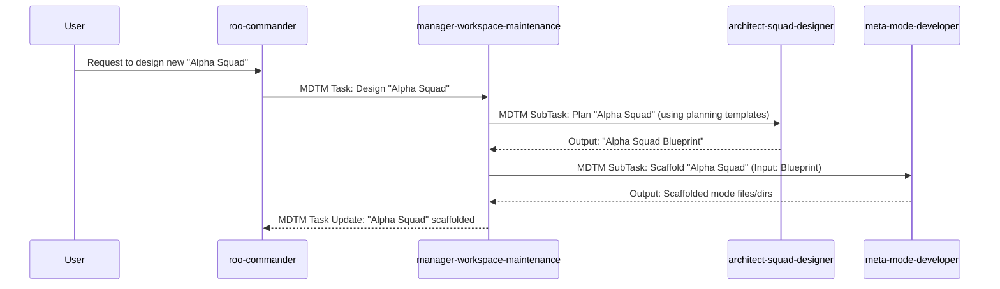

+++
# --- Squad Planning: Workflow & Artifact Flow ---
id = "SQUAD-WORKFLOW-WSMAINT-20250720"
title = "Squad Workflow & Service Flows: Workspace Maintenance Squad"
status = "draft"
created_date = "{{YYYYMMDD}}"
updated_date = "{{YYYYMMDD}}"
version = "1.0"
tags = ["squad-planning", "workflow-design", "artifact-flow", "orchestration-planning", "workspace-maintenance-squad", "service-flows"]
template_schema_doc = ".roo/commander/templates/planning/squad_design/template_02_squad_workflow_and_artifact_flow.README.md"

# --- Squad & Workflow Identification ---
squad_unit_name_ref = "Workspace Maintenance Squad"
squad_concept_doc_id = "SQUAD-CONCEPT-WS-MAINT-20250720"
managing_mode_slug_ref = "manager-workspace-maintenance"

workflow_name = "Workspace Maintenance Service Flows" # This is a collection of flows
# workflow_version = "1.0"
# estimated_total_phases = "Varies per service" # Not a single linear flow

# --- Key Workflow Characteristics ---
overall_workflow_objective = "To provide a suite of AI-assisted services for the setup, ongoing maintenance, quality assurance, and systematic evolution of the Roo Commander V8 workspace itself."
# key_input_to_workflow_start = "A specific maintenance or extension request from a user or another system component, assigned as an MDTM task to manager-workspace-maintenance."
# final_output_of_workflow = "Completed maintenance/evolution task (e.g., new mode scaffolded, KB updated, MCP server configured, release packaged)."
+++

# Squad Workflow & Service Flows: Workspace Maintenance Squad

## 1. Overview

*   **Workflow Name:** Workspace Maintenance Service Flows
*   **Squad Unit:** `Workspace Maintenance Squad`
*   **Managing Mode:** `manager-workspace-maintenance`
*   **Purpose of this Document:** To define the typical operational flows for key services provided by the `Workspace Maintenance Squad`. Unlike a single linear production workflow, this squad offers various distinct services, each orchestrated by `manager-workspace-maintenance` by delegating to one or more specialist squad members. This document outlines these primary service flows and the associated artifact handoffs.

## 2. Overall Workflow Objective

*   The `Workspace Maintenance Squad`, managed by `manager-workspace-maintenance`, aims to provide a suite of AI-assisted services for the setup, ongoing maintenance, quality assurance, and systematic evolution of the Roo Commander V8 workspace itself, ensuring its robustness, consistency, and adaptability.

## 3. Key Service Flows & Artifact Handoffs

The `manager-workspace-maintenance` will receive an MDTM task from `roo-commander` (or a human developer) specifying a particular maintenance or evolution goal. Based on this goal, the manager will initiate one of the following (or similar) service flows by creating MDTM sub-tasks for its squad members.

---
### **Service Flow 3.1: Onboard New Manager + Squad Unit (Full Design & Scaffolding)**

*   **Trigger:** Request to design and scaffold a completely new Manager + Squad unit.
*   **Overall Goal:** Produce a full set of planning documents and then the scaffolded boilerplate files for the new unit.
*   **Sequence & Artifact Flow:**
    1.  **Manager (Input):** High-level concept for new squad unit.
    2.  **`architect-squad-designer` (Phase 1 - Planning):**
        *   Inputs: User's high-level concept.
        *   Activities: Collaboratively (via Manager) fills out:
            *   `00-concept-mission-[new_squad].md`
            *   Multiple `01-role-[new_member].md`
            *   `02-workflow-[new_squad].md`
            *   `03-research-plan-[new_squad].md`
            *   `04-blueprint-[new_squad].md`
        *   Outputs: The complete set of planning documents for the new squad, saved in `[.roo/commander/planning/squad_designs/[new_squad_name]/](.roo/commander/planning/squad_designs/[new_squad_name]/)`.
    3.  **`meta-mode-developer` (Phase 2 - Scaffolding):**
        *   Inputs: Path to the approved `04-blueprint-[new_squad].md` and its linked detailed planning docs.
        *   Activities: Creates all directories and boilerplate files (`.mode.md`, `rules-.../00-...core-principles.md`, `kb/README.md`, etc.) for the new Manager and its Squad members, based on the blueprint and using system templates.
        *   Outputs: Scaffolded directories and files in `[.roo/commander/modes/](.roo/commander/modes/)` and `[.roo/rules-[mode_slug]/](.roo/rules-[mode_slug]/)`. A report of files created.
    4.  **Manager (Output):** Confirmation of planning docs and scaffolded files created. Next steps might involve `meta-kb-editor` or human developers.

---
### **Service Flow 3.2: Add New Squad Member to Existing Squad**

*   **Trigger:** Request to add a new specialist role to an existing Manager's squad.
*   **Overall Goal:** Define the new role and update the existing Manager's configuration.
*   **Sequence & Artifact Flow:**
    1.  **Manager (Input):** Details of the existing Manager, proposed new role, and justification.
    2.  **`architect-squad-designer`:**
        *   Inputs: Manager details, new role concept.
        *   Activities: Fills out `template_00_new_squad_member_proposal.md`.
        *   Outputs: `00-proposal-add-[new_member]-to-[manager].md`.
    3.  **(Human Review/Approval of Proposal)**
    4.  **`meta-mode-developer` (If proposal approved):**
        *   Inputs: Approved proposal, details for the new squad member.
        *   Activities: Scaffolds the new squad member's mode files (as in 3.1.2 for a single mode).
        *   Outputs: Scaffolded files for the new squad member.
    5.  **`meta-workflow-integrator` (or `meta-kb-editor` for Manager's KB):**
        *   Inputs: Details of new member, existing Manager's slug.
        *   Activities: Updates the existing Manager's `kb/reference/00-squad-composition.md`, `kb/procedures/01-main-orchestration-flow.md`, and `.mode.md` (`delegate_to` list).
        *   Outputs: Updated Manager configuration files.
    6.  **Manager (Output):** Confirmation of new member scaffolded and Manager configuration updated.

---
### **Service Flow 3.3: Populate/Update a Mode's KB Article**

*   **Trigger:** Request to create or update a specific KB article for a mode.
*   **Overall Goal:** A new or updated KB article within a target mode's KB.
*   **Sequence & Artifact Flow:**
    1.  **Manager (Input):** Target mode slug, KB article path (e.g., `kb/skills/new_skill.md`), source material or objectives for the content.
    2.  **`meta-kb-editor`:**
        *   Inputs: As provided by Manager.
        *   Activities: Reads source material, selects appropriate KB article template (e.g., `template_00_kb_skill.md`), authors/edits the content, saves the file, updates the target mode's KB `README.md`.
        *   Outputs: The new/updated KB article file, updated KB `README.md`.
    3.  **Manager (Output):** Confirmation of KB article creation/update.

---
### **Service Flow 3.4: Setup Local MCP Server Infrastructure**

*   **Trigger:** User/developer needs to set up a local MCP server (e.g., for Vertex AI, Ollama).
*   **Overall Goal:** User is guided to a functional local MCP server setup.
*   **Sequence & Artifact Flow:**
    1.  **Manager (Input):** Type of MCP server needed, user's OS.
    2.  **`infra-mcp-setup-specialist`:**
        *   Inputs: As provided by Manager.
        *   Activities: Provides step-by-step guidance for Docker Desktop (if needed) and the specific MCP server setup, referencing its own KB. May ask clarifying questions via Manager.
        *   Outputs: Conversational guidance, status report (e.g., "User guided through Ollama setup").
    3.  **Manager (Output):** Confirmation that guidance was provided.

---
### **Service Flow 3.5: Perform Build & GitHub Release**

*   **Trigger:** Request to perform a new release of Roo Commander V8.
*   **Overall Goal:** A new version of Roo Commander V8 is built, tagged, and released on GitHub.
*   **Sequence & Artifact Flow:**
    1.  **Manager (Input):** Target version number, confirmation code is ready.
    2.  **`release-process-assistant`:**
        *   Inputs: As provided by Manager.
        *   Activities: Follows the `01_sop_build_and_github_release.md`. This involves:
            *   Guiding/executing `git log` analysis for changelog.
            *   Guiding/editing `CHANGELOG.md`.
            *   Guiding/creating `release_notes_vX.Y.Z.md`.
            *   Guiding/executing commit of these files.
            *   Executing `build_roomodes-v8.js`.
            *   Executing packaging script.
            *   Guiding/executing Git tagging and pushing.
            *   Guiding/executing GitHub release creation (e.g., via `gh` CLI).
        *   Outputs: Updated `CHANGELOG.md`, new `release_notes.md`, build package, Git tag, GitHub release. Status reports at each major step.
    3.  **Manager (Output):** Confirmation of successful release or detailed error report.

---
*(More service flows can be added here for other squad members like `devops-dependency-manager`, `standards-guardian`, `system-documentation-updater`, `symbolic-language-refactor-agent`)*

## 4. Visual Workflow & Artifact Flow Diagram (Conceptual for Key Services)

*(This section would ideally have a few high-level Mermaid diagrams illustrating some of the more complex service flows, like "Onboard New Manager + Squad Unit" or "Perform Build & GitHub Release," showing the interaction between the Manager and the involved squad members.)*

**Example: Onboard New Manager + Squad Unit**

## 5. Key Dependencies & Handoff Points

*   Many service flows depend on the **clarity of the initial MDTM task** from `roo-commander` to `manager-workspace-maintenance`.
*   The "Onboard New Manager + Squad Unit" flow has a critical handoff from `architect-squad-designer` (planning complete) to `meta-mode-developer` (scaffolding begins). The "Squad Design Summary & Blueprint" is the key artifact.
*   The "Build & Release" flow has many sequential dependencies managed by `release-process-assistant`.

## 6. Considerations for `manager-workspace-maintenance`

*   Its primary KB procedure (`kb/procedures/01-main-orchestration-flow.md`) will need to be a sophisticated router or decision tree that, based on its input MDTM task, identifies which service flow to initiate and which initial squad member(s) to delegate to.
*   It will need to manage multiple, potentially concurrent, MDTM sub-tasks for different service requests.

This document provides the blueprint for the diverse operational service flows of the `Workspace Maintenance Squad`.