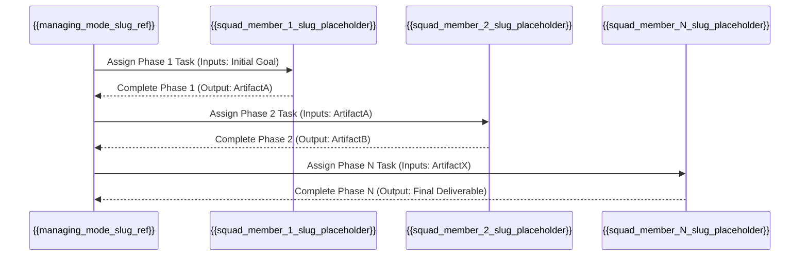

+++
# --- Squad Planning: Workflow & Artifact Flow ---
id = "SQUAD-WORKFLOW-[SquadUnitNameShort]-[YYYYMMDD]" # Placeholder: e.g., SQUAD-WORKFLOW-WEBAPP-20250719
title = "Squad Workflow & Artifact Flow: [Squad Unit Name]" # Placeholder
status = "draft" # Default. Options: draft, proposed, under-review, defined
created_date = "{{YYYYMMDD}}" # Placeholder: To be set by creating agent
last_updated = "{{TIMESTAMP_ISO_Z}}" # Placeholder: To be set by creating agent
version = "1.0" # Version of this workflow document instance
tags = ["squad-planning", "workflow-design", "artifact-flow", "orchestration-planning", "[squad_name_tag]"] # Placeholder: Add specific tags
template_schema_doc = ".roo/commander/templates/planning/squad_design/template_02_squad_workflow_and_artifact_flow.README.md"

# --- Squad & Workflow Identification ---
squad_unit_name_ref = "[Full Name of the Squad Unit]" # REQUIRED - Placeholder: Matches 'squad_unit_name' from 00_squad_concept_and_mission.md
squad_concept_doc_id = "[ID of the parent squad concept document. Or remove field.]" # OPTIONAL - Placeholder: e.g., "SQUAD-CONCEPT-[SquadUnitNameShort]-[YYYYMMDD]" or remove
managing_mode_slug_ref = "[proposed_managing_mode_slug from 00_squad_concept_and_mission.md]" # RECOMMENDED - Placeholder

workflow_name = "[Descriptive Name for this Squad's Primary Workflow]" # REQUIRED - Placeholder: e.g., "Standard Web Application Scaffolding Workflow"
workflow_version = "1.0" # Default for a new workflow definition
estimated_total_phases = 0 # Placeholder: Number of distinct squad member engagements in sequence, to be filled

# --- Key Workflow Characteristics ---
overall_workflow_objective = "[The ultimate goal this entire sequence of squad activities aims to achieve. Or remove field.]" # RECOMMENDED - Placeholder or remove
key_input_to_workflow_start = "[What triggers this workflow / what's the initial input to the first squad member? Or remove field.]" # RECOMMENDED - Placeholder or remove
final_output_of_workflow = "[What is the final consolidated artifact produced at the end of this workflow? Or remove field.]" # RECOMMENDED - Placeholder or remove
+++

# Squad Workflow & Artifact Flow: {{ squad_unit_name_ref | default: "[Squad Unit Name]" }}

## 1. Overview 🗺️

*   **Workflow Name:** `{{ workflow_name | default: "[Specify Workflow Name]" }}`
*   **Squad Unit:** `{{ squad_unit_name_ref | default: "[Squad Unit Name]" }}`
*   **Managing Mode (Conceptual):** `{{ managing_mode_slug_ref | default: "[manager-slug]" }}`
*   **Purpose of this Document:** To define the sequential operational flow for the `{{ squad_unit_name_ref }}`. This includes identifying each phase of work, the responsible squad member (by slug) for that phase, the key input artifacts they require (often outputs from previous phases), and the primary output artifacts they produce. This document is essential for designing the main orchestration procedure (e.g., `01-main-orchestration-flow.md`) of the `{{ managing_mode_slug_ref }}`.

## 2. Overall Workflow Objective 🎯

*   `{{ overall_workflow_objective | default: "[State the ultimate goal this workflow achieves, e.g., 'To produce a fully scaffolded Next.js web application with basic CRUD functionality for a specified data model.']" }}`

## 3. Sequential Phase Breakdown & Artifact Flow 🔄

*(This section details each phase of the workflow, the responsible squad member, their inputs, and their outputs. This information **MUST** be consistent with the individual `template_01_squad_member_role_definition.md` documents created for each member. All artifact paths mentioned should be conceptual target locations, typically within a session's artifacts, e.g., `[.roo/commander/sessions/[SESSION_ID]/artifacts/[output_subdir]/[ProductNameOrIdentifier]/[filename]]`.)*

---
### **Phase 1: `[Name of Phase 1, e.g., Initial Requirements Gathering & Setup]`**

*   **Responsible Squad Member (Slug):** `[squad_member_1_slug]`
    *   *(Role: `[Brief Role Description from their Role Definition doc]`)*
*   **Input Artifact(s) for this Phase:**
    *   `[Description of Input 1, e.g., "User's high-level project goal (from Manager's MDTM task description or a specific input artifact like '.roo/.../initial_brief.md')"]`
    *   `[Description of Input 2, e.g., "Active Session ID and Path (e.g., `[.roo/commander/sessions/[SESSION_ID]/]`) for context"]`
*   **Key Activities / Purpose of this Phase:**
    *   `[Activity 1, e.g., "Clarify core requirements with Manager (if needed)."]`
    *   `[Activity 2, e.g., "Set up initial project directory structure within session artifacts."]`
*   **Primary Output Artifact(s) from this Phase:**
    *   `[Filename/Type of Output 1, e.g., requirements_summary_v1.md]`
        *   *Conceptual Target Path:* `[e.g., `[.roo/commander/sessions/[SESSION_ID]/artifacts/planning_outputs/[ProjectName]/requirements_summary_v1.md]`]`
        *   *Template Used (if any):* `[e.g., `[.roo/commander/templates/some_template.md]`]`
    *   `[Filename/Type of Output 2, e.g., initial_project_scaffold_status.txt]`
        *   *Conceptual Target Path:* `[Path]`
        *   *Template Used (if any):* `[Path]`

---
### **Phase 2: `[Name of Phase 2, e.g., UI Mockup Design]`**

*   **Responsible Squad Member (Slug):** `[squad_member_2_slug]`
    *   *(Role: `[Brief Role Description]`)*
*   **Input Artifact(s) for this Phase:**
    *   `[Output 1 from Phase 1, e.g., Path to requirements_summary_v1.md]`
    *   `[Other necessary inputs]`
*   **Key Activities / Purpose of this Phase:**
    *   `[Activity 1]`
    *   `[Activity 2]`
*   **Primary Output Artifact(s) from this Phase:**
    *   `[Filename/Type of Output, e.g., ui_mockups_v1.md]`
        *   *Conceptual Target Path:* `[Path]`
        *   *Template Used (if any):* `[Path]`

---
*(Continue this pattern for all sequential phases/squad members in the workflow)*

---
### **Phase N: `[Name of Final Phase, e.g., Final Review & Packaging]`**

*   **Responsible Squad Member (Slug):** `[squad_member_N_slug]`
    *   *(Role: `[Brief Role Description]`)*
*   **Input Artifact(s) for this Phase:**
    *   `[Outputs from all relevant preceding phases, listing their typical filenames or conceptual paths]`
*   **Key Activities / Purpose of this Phase:**
    *   `[Activity 1, e.g., "Consolidate all deliverables."]`
    *   `[Activity 2, e.g., "Perform final quality checks."]`
*   **Primary Output Artifact(s) from this Phase:**
    *   `[Final consolidated deliverable of the entire workflow, e.g., deployment_package_v1.zip, comprehensive_design_document_final.md]`
        *   *Conceptual Target Path:* `[Path]`
        *   *Template Used (if any):* `[Path]`

---

## 4. Visual Workflow & Artifact Flow Diagram (Conceptual) 📊

*(Use Mermaid JS or a similar textual diagramming tool to illustrate the sequence of squad members and the primary artifacts passed between them. This should visually represent the information from Section 3. Use squad member slugs.)*

**Example (Mermaid Sequence Diagram):**

*(Replace placeholders like `{{squad_member_1_slug_placeholder}}` with actual proposed slugs when instantiating)*

## 5. Key Dependencies & Handoff Points 🔗

[Highlight any critical dependencies between phases or specific requirements for handoff points to ensure smooth transitions. Emphasize that artifact paths will be workspace-root-relative starting with `.roo/` in actual MDTM tasks.]
*   Dependency 1: Phase `[X]` cannot start until `[ArtifactY]` from Phase `[X-1]` is complete and its path is available.
*   Handoff Point 1: Between `[SquadMemberA_slug]` and `[SquadMemberB_slug]`, ensure `[SpecificDataFormat/Standard]` is used for `[ArtifactZ]`.

## 6. Considerations for the Managing Mode (`{{ managing_mode_slug_ref }}`) 🧠

*   The `{{ managing_mode_slug_ref }}` will use this workflow to structure its main orchestration procedure in its KB (e.g., `[.roo/commander/modes/{{ managing_mode_slug_ref }}/kb/procedures/01-main-orchestration-flow.md]`).
*   MDTM sub-tasks created by the Manager for each phase **MUST** clearly specify the `input_artifacts` (using actual `.roo/` anchored paths to outputs from the previous phase) and the expected `output_artifacts` (including target `.roo/` anchored filenames and paths within the session artifacts).

This document provides the blueprint for the operational sequence of the `{{ squad_unit_name_ref }}`.