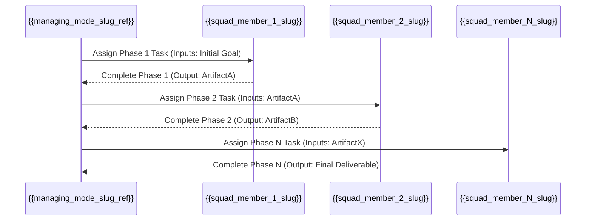

+++
# --- Squad Planning: Workflow & Artifact Flow ---
id = "SQUAD-WORKFLOW-[SquadUnitNameShort]-[YYYYMMDD]" # e.g., SQUAD-WORKFLOW-WEBAPP-20250719
title = "Squad Workflow & Artifact Flow: [Squad Unit Name]"
status = "draft" # Options: draft, proposed, under-review, defined
created_date = "{{YYYYMMDD}}"
updated_date = "{{YYYYMMDD}}"
version = "1.0" # Version of this workflow document
tags = ["squad-planning", "workflow-design", "artifact-flow", "orchestration-planning", "[squad_name_tag]"]
template_schema_doc = ".roo/commander/templates/planning/squad_design/template_02_squad_workflow_and_artifact_flow.README.md"

# --- Squad & Workflow Identification ---
squad_unit_name_ref = "[Full Name of the Squad Unit (matches 'squad_unit_name' from 00_squad_concept_and_mission.md)]"
# squad_concept_doc_id = "SQUAD-CONCEPT-[SquadUnitNameShort]-[YYYYMMDD]" # ID of the parent squad concept document
# managing_mode_slug_ref = "[proposed_managing_mode_slug from 00_squad_concept_and_mission.md]"

workflow_name = "[Descriptive Name for this Squad's Primary Workflow, e.g., Standard Web Application Scaffolding Workflow]"
# workflow_version = "1.0"
# estimated_total_phases = 0 # Number of distinct squad member engagements in sequence

# --- Key Workflow Characteristics ---
# overall_workflow_objective = "[The ultimate goal this entire sequence of squad activities aims to achieve, often matches 'target_primary_output_of_unit' from 00_squad_concept_and_mission.md]"
# key_input_to_workflow_start = "[What triggers this workflow / what's the initial input to the first squad member?]"
# final_output_of_workflow = "[What is the final consolidated artifact produced at the end of this workflow?]"
+++

# Squad Workflow & Artifact Flow: {{ squad_unit_name_ref | default: "[Squad Unit Name]" }}

## 1. Overview

*   **Workflow Name:** `{{ workflow_name | default: "[Specify Workflow Name]" }}`
*   **Squad Unit:** `{{ squad_unit_name_ref | default: "[Squad Unit Name]" }}`
*   **Managing Mode (Conceptual):** `{{ managing_mode_slug_ref | default: "[manager-slug]" }}`
*   **Purpose of this Document:** To define the sequential operational flow for the `[Squad Unit Name]`. This includes identifying each phase of work, the responsible squad member for that phase, the key input artifacts they require, and the primary output artifacts they produce. This document is essential for designing the main orchestration procedure of the `[Managing Mode Name]`.

## 2. Overall Workflow Objective

*   `{{ overall_workflow_objective | default: "[State the ultimate goal this workflow achieves, e.g., 'To produce a fully scaffolded Next.js web application with basic CRUD functionality for a specified data model.']" }}`

## 3. Sequential Phase Breakdown & Artifact Flow

*(This section details each phase of the workflow, the responsible squad member, their inputs, and their outputs. This information should be consistent with the individual `template_01_squad_member_role_definition.md` documents created for each member.)*

---
### **Phase 1: `[Name of Phase 1, e.g., Initial Requirements Gathering & Setup]`**

*   **Responsible Squad Member (Slug):** `[squad_member_1_slug]`
    *   *(Role: `[Brief Role Description from their Role Definition doc]`)*
*   **Input Artifact(s) for this Phase:**
    *   `[Description of Input 1, e.g., "User's high-level project goal (from Manager's MDTM task)"]`
    *   `[Description of Input 2, e.g., "Active Session ID and Path"]`
*   **Key Activities / Purpose of this Phase:**
    *   `[Activity 1, e.g., "Clarify core requirements with Manager (if needed)."]`
    *   `[Activity 2, e.g., "Set up initial project directory structure."]`
*   **Primary Output Artifact(s) from this Phase:**
    *   `[Filename/Type of Output 1, e.g., requirements_summary_v1.md]` - Stored at `[Target Path]`
    *   `[Filename/Type of Output 2, e.g., initial_project_scaffold_status.txt]` - Stored at `[Target Path]`

---
### **Phase 2: `[Name of Phase 2, e.g., UI Mockup Design]`**

*   **Responsible Squad Member (Slug):** `[squad_member_2_slug]`
    *   *(Role: `[Brief Role Description]`)*
*   **Input Artifact(s) for this Phase:**
    *   `[Output 1 from Phase 1, e.g., requirements_summary_v1.md]`
    *   `[Other necessary inputs]`
*   **Key Activities / Purpose of this Phase:**
    *   `[Activity 1]`
    *   `[Activity 2]`
*   **Primary Output Artifact(s) from this Phase:**
    *   `[Filename/Type of Output, e.g., ui_mockups_v1.md]` - Stored at `[Target Path]`

---
*(Continue this pattern for all sequential phases/squad members in the workflow)*

---
### **Phase N: `[Name of Final Phase, e.g., Final Review & Packaging]`**

*   **Responsible Squad Member (Slug):** `[squad_member_N_slug]`
    *   *(Role: `[Brief Role Description]`)*
*   **Input Artifact(s) for this Phase:**
    *   `[Outputs from all relevant preceding phases]`
*   **Key Activities / Purpose of this Phase:**
    *   `[Activity 1, e.g., "Consolidate all deliverables."]`
    *   `[Activity 2, e.g., "Perform final quality checks."]`
*   **Primary Output Artifact(s) from this Phase:**
    *   `[Final consolidated deliverable of the entire workflow, e.g., deployment_package_v1.zip, comprehensive_design_document_final.md]` - Stored at `[Target Path]`

---

## 4. Visual Workflow & Artifact Flow Diagram (Conceptual)

*(Use Mermaid JS or a similar textual diagramming tool to illustrate the sequence of squad members and the primary artifacts passed between them. This should visually represent the information from Section 3.)*

**Example (Mermaid Sequence Diagram):**

## 5. Key Dependencies & Handoff Points

[Highlight any critical dependencies between phases or specific requirements for handoff points to ensure smooth transitions.]
*   Dependency 1: Phase `[X]` cannot start until `[ArtifactY]` from Phase `[X-1]` is complete and validated.
*   Handoff Point 1: Between `[SquadMemberA]` and `[SquadMemberB]`, ensure `[SpecificDataFormat/Standard]` is used for `[ArtifactZ]`.

## 6. Considerations for the Managing Mode

*   The `[Managing Mode Name]` will use this workflow to structure its `kb/procedures/01-main-orchestration-flow.md`.
*   MDTM sub-tasks created by the Manager for each phase **MUST** clearly specify the `input_artifacts` (based on outputs from the previous phase) and the expected `output_artifacts` (including target filenames and paths within the session artifacts).

This document provides the blueprint for the operational sequence of the `[Squad Unit Name]`.