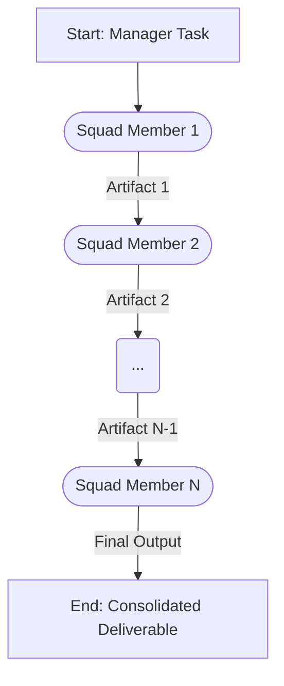

+++
# --- Squad Planning: Design Summary & Blueprint ---
id = "SQUAD-BLUEPRINT-[SquadUnitNameShort]-[YYYYMMDD]" # e.g., SQUAD-BLUEPRINT-WEBAPP-20250719
title = "Squad Design Summary & Blueprint: [Squad Unit Name]"
status = "draft" # Options: draft, proposed, under-review, approved-for-development, archived
created_date = "{{YYYYMMDD}}"
updated_date = "{{YYYYMMDD}}"
version = "1.0" # Version of this blueprint document
tags = ["squad-planning", "design-summary", "blueprint", "orchestration-design", "[squad_name_tag]"]
template_schema_doc = ".roo/commander/templates/planning/squad_design/template_04_squad_design_summary_and_blueprint.README.md"

# --- Squad & Blueprint Identification ---
squad_unit_name = "[Full Name of the Squad Unit (matches 'squad_unit_name' from 00_squad_concept_and_mission.md)]"
# proposed_managing_mode_slug = "[proposed_managing_mode_slug from 00_squad_concept_and_mission.md]"
# version_of_planning_inputs = "1.0" # Version of the input planning documents this summary is based on

# --- Links to Detailed Planning Documents (CRITICAL) ---
linked_squad_concept_doc = "[Path to the filled 00_squad_concept_and_mission.md]"
linked_squad_member_role_docs = [ # List paths to all filled 01_squad_member_role_definition.md files
    # "[Path to role_def_member1.md]",
    # "[Path to role_def_member2.md]"
]
linked_workflow_doc = "[Path to the filled 02_squad_workflow_and_artifact_flow.md]"
linked_research_plan_doc = "[Path to the filled 03_squad_knowledge_and_research_plan.md]"

# --- Key Summary Points (Extracted - details in linked docs) ---
# overall_mission_summary = "[1-2 sentence summary of mission from concept doc]"
# number_of_squad_members = 0
# key_workflow_output = "[Final deliverable from workflow doc]"
# primary_research_focus_areas = ["[Area1 from research plan]", "[Area2 from research plan]"]
+++

# Squad Design Summary & Blueprint: {{ squad_unit_name | default: "[Squad Unit Name]" }}

## 1. Overview & Purpose of this Blueprint

*   **Squad Unit:** `{{ squad_unit_name | default: "[Squad Unit Name]" }}`
*   **Proposed Managing Mode:** `{{ proposed_managing_mode_slug | default: "[manager-slug]" }}`
*   **Purpose:** This document serves as a consolidated summary and final blueprint for the design of the `[Squad Unit Name]`. It synthesizes key information from the detailed planning documents (Concept & Mission, Squad Member Roles, Workflow & Artifact Flow, and Knowledge & Research Plan).
*   **Next Step:** Upon approval, this blueprint guides the actual development of the Manager mode, its Squad Member modes, their respective rules, and their Knowledge Bases.

## 2. Links to Detailed Planning Documents

This summary is based on the following detailed planning documents:

*   **Squad Concept & Mission:** `{{ linked_squad_concept_doc | default: "[Path to 00_squad_concept_and_mission.md]" }}`
*   **Squad Member Role Definitions:**
    *   `{{ linked_squad_member_role_docs[0] | default: "[Path to Role Doc 1]" }}`
    *   `{{ linked_squad_member_role_docs[1] | default: "[Path to Role Doc 2]" }}`
    *   *(List all role definition documents)*
*   **Squad Workflow & Artifact Flow:** `{{ linked_workflow_doc | default: "[Path to 02_squad_workflow_and_artifact_flow.md]" }}`
*   **Squad Knowledge & Research Plan:** `{{ linked_research_plan_doc | default: "[Path to 03_squad_knowledge_and_research_plan.md]" }}`

## 3. Executive Summary of the Squad Unit

### 3.1. Mission & Value Proposition
*   [Summarize the core mission and value proposition from `00_squad_concept_and_mission.md`. What problem does this unit solve, and what key benefits does it provide?]
*   *(Corresponds to `overall_mission_summary` in TOML if used)*

### 3.2. Primary Output / Deliverable
*   [State the main tangible output of this squad unit's entire workflow.]
*   *(Corresponds to `key_workflow_output` in TOML if used)*

## 4. Squad Composition Summary

[Provide a table summarizing the proposed squad members, their slugs, and their core responsibilities. This is a condensed view from all the `01_squad_member_role_definition.md` files.]

| Proposed Mode Name                      | Proposed Slug                         | Core Responsibility within Squad Workflow                     | Primary Output Artifact Type(s)        |
|-----------------------------------------|---------------------------------------|---------------------------------------------------------------|----------------------------------------|
| `[Name of Squad Member 1]`              | `[squad_member_1_slug]`               | `[1-sentence summary of responsibility]`                      | `[e.g., product_strategy.md]`          |
| `[Name of Squad Member 2]`              | `[squad_member_2_slug]`               | `[1-sentence summary of responsibility]`                      | `[e.g., poc_ideation.md]`              |
| ...                                     | ...                                   | ...                                                           | ...                                    |
| `[Name of Final Squad Member]`          | `[squad_member_N_slug]`               | `[1-sentence summary of responsibility]`                      | `[e.g., data_product_poc_plan.md]`     |

*   **Total Squad Members Proposed:** `{{ number_of_squad_members | default: "[Number]" }}`

## 5. Workflow & Artifact Flow Overview

[Provide a high-level summary of the squad's operational sequence. The Mermaid diagram from `02_squad_workflow_and_artifact_flow.md` can be embedded or referenced here. Briefly describe the main phases and critical handoffs.]

**Visual Flow (Example - Embed or Link to Diagram in Workflow Doc):**

## 6. Key Knowledge & Research Requirements Summary

[Summarize the most critical knowledge domains and research activities identified in `03_squad_knowledge_and_research_plan.md`. Highlight any dependencies on MCP tools or significant knowledge gaps that need to be addressed to make the squad effective.]

*   **Primary Research Focus Areas:**
    *   `{{ primary_research_focus_areas[0] | default: "[Focus Area 1]" }}`
    *   `{{ primary_research_focus_areas[1] | default: "[Focus Area 2]" }}`
*   **Key MCP Tools Identified for Bootstrapping KB:** `[List any specific MCPs]`

## 7. Proposed Next Steps for Development

[Outline the immediate next steps based on this blueprint.]
1.  Architectural Review and Approval of this Squad Design Blueprint.
2.  Create `.mode.md` definition files for the `[Proposed Managing Mode Slug]` and all listed squad members, using the appropriate archetype templates.
3.  Develop core mode-specific rules (`00-...-core-principles.md`, `01-...-squad-orchestration.md` for Manager) for each new mode.
4.  Structure and populate initial KBs (READMEs, core procedures, references) for each new mode.
5.  Update `roo-commander`'s KB (`reference/00-available-managers-summary.md`) and mode definition (`delegate_to` list) to integrate the new `[Proposed Managing Mode Slug]`.
6.  Begin iterative testing of the new Manager + Squad unit.

This blueprint provides a comprehensive plan for developing the `[Squad Unit Name]`.