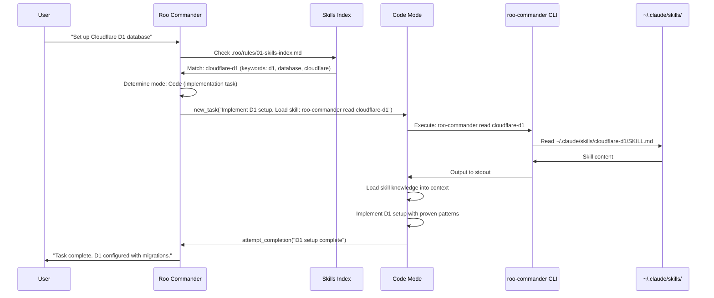
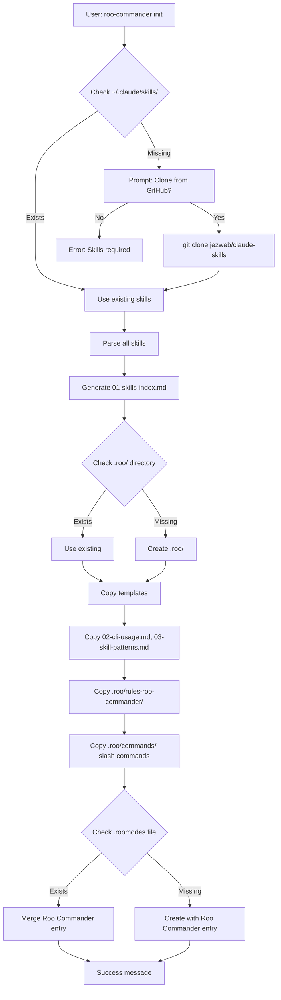
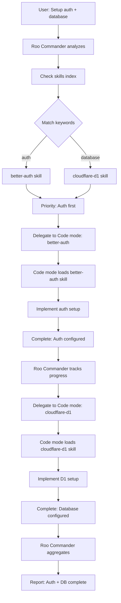

# Architecture: Roo Commander v9

**System Type**: CLI Tool + Custom Mode + Shared Knowledge System
**Deployment**: npm (CLI), Roo Code Marketplace (Mode)
**Runtime**: Node.js (CLI), VS Code Extension (Roo Code)

---

## System Overview

```
┌─────────────────────────────────────────────────────────┐
│                    Roo Code VS Code Extension            │
│  ┌────────────────────────────────────────────────────┐ │
│  │  Built-in Modes                                    │ │
│  │  ┌──────────┐  ┌───────────┐  ┌────────┐         │ │
│  │  │ 💻 Code  │  │ 🏗️ Architect │  │ 🪲 Debug │         │ │
│  │  └─────┬────┘  └──────┬────┘  └───┬────┘         │ │
│  │        │               │            │              │ │
│  │        └───────────────┴────────────┘              │ │
│  │                        ↑                           │ │
│  │              Reads .roo/rules/ (global context)    │ │
│  │                        ↓                           │ │
│  │  ┌─────────────────────────────────────────────┐  │ │
│  │  │ Custom Instructions (.roo/rules/)           │  │ │
│  │  │ • 01-skills-index.md (68 skills)            │  │ │
│  │  │ • 02-cli-usage.md (how to use CLI)          │  │ │
│  │  │ • 03-skill-patterns.md (when to use skills) │  │ │
│  │  └─────────────────────────────────────────────┘  │ │
│  │                                                    │ │
│  │  ┌─────────────────────────────────────────────┐  │ │
│  │  │ 🪃 Roo Commander Mode (Orchestrator)         │  │ │
│  │  │ • Analyzes user requests                    │  │ │
│  │  │ • Identifies relevant skills                │  │ │
│  │  │ • Delegates to Code/Architect/Debug         │  │ │
│  │  │ • Tracks progress                           │  │ │
│  │  └──────────────────┬──────────────────────────┘  │ │
│  │                     │                              │ │
│  │                     │ Uses new_task to delegate    │ │
│  │                     ↓                              │ │
│  │         ┌───────────────────────┐                 │ │
│  │         │   Execution Modes     │                 │ │
│  │         │   Run CLI commands    │                 │ │
│  │         │   Load skill knowledge│                 │ │
│  │         │   Implement solution  │                 │ │
│  │         └───────────────────────┘                 │ │
│  └────────────────────────────────────────────────────┘ │
└─────────────────────────────────────────────────────────┘
                          ↓ Executes
              ┌───────────────────────────┐
              │   roo-commander CLI       │
              │   (npm global package)    │
              │                           │
              │   Commands:               │
              │   • list                  │
              │   • read <skill>          │
              │   • search <keyword>      │
              │   • generate-index        │
              │   • sync-index            │
              │   • init                  │
              └────────────┬──────────────┘
                          │ Reads from
                          ↓
              ┌───────────────────────────┐
              │   ~/.claude/skills/       │
              │   (68 production skills)  │
              │                           │
              │   • cloudflare-d1/        │
              │   • better-auth/          │
              │   • tailwind-v4-shadcn/   │
              │   • ... 65 more           │
              └───────────────────────────┘
```

---

## Component Breakdown

### 1. CLI Tool (`@jezweb/roo-commander`)

**Purpose**: Bridge between Claude Code skills and Roo Code modes

**Technology**: TypeScript + Node.js
**Distribution**: npm (global install)
**Location**: `~/.npm-global/bin/roo-commander`

**Responsibilities**:
- Read skills from `~/.claude/skills/` directory
- Parse YAML frontmatter + markdown content
- Output skill content to stdout
- Generate skills index markdown
- Initialize Roo Commander setup in projects

**Key Commands**:
```bash
roo-commander list              # Show all 68 skills
roo-commander read cloudflare-d1 # Output skill content
roo-commander search database    # Find relevant skills
roo-commander generate-index    # Create skills index
roo-commander sync-index        # Update skills index
roo-commander init              # Set up in project
```

**Why CLI Instead of MCP?**
- Simpler architecture (no background process)
- Explicit control (sync when needed)
- Easier debugging (just files)
- Lighter weight (no server overhead)
- Acceptable latency (skills don't change every session)

### 2. Custom Instructions (`.roo/rules/`)

**Purpose**: Shared knowledge system for ALL Roo modes

**Location**: Project workspace (`.roo/rules/`)
**Format**: Numbered markdown files
**Loaded by**: All modes automatically (Code, Architect, Debug, Roo Commander)

**Files**:

**01-skills-index.md** (~800 lines):
- Auto-generated list of all 68 skills
- Categorized by domain (AI, Cloudflare, Frontend, Auth, etc.)
- Includes description and keywords for each skill
- Teaches modes what skills exist and when to use them

**02-cli-usage.md** (~150 lines):
- How to use `roo-commander` CLI commands
- Command syntax and examples
- Expected output format
- Troubleshooting common issues

**03-skill-patterns.md** (~200 lines):
- When to check for skills before implementing
- Skill-aware development workflows
- Anti-patterns (when NOT to use skills)
- Examples of skill-aware vs manual implementation

**Why Global Rules?**
- ALL modes need skill awareness (not just Roo Commander)
- User might be in Code mode directly and want to check skills
- Reduces duplication (one source of truth)
- Easier to keep in sync (update one file)

**Loading Hierarchy**:
1. Global rules (`~/.roo/rules/`) - applies to all projects
2. Workspace rules (`.roo/rules/`) - project-specific
3. Mode-specific rules (`.roo/rules-{slug}/`) - mode behavior

### 3. Roo Commander Mode (Custom Mode)

**Purpose**: Intelligent orchestrator that routes tasks to execution modes

**Configuration**: `.roomodes` entry + `.roo/rules-roo-commander/`
**Tool Access**: `workflow` group only (new_task, attempt_completion, ask_followup_question)
**No Access**: read, edit, command (forces delegation)

**Responsibilities**:
- Analyze user requests for complexity and requirements
- Check skills index for relevant knowledge
- Identify appropriate execution mode (Code/Architect/Debug)
- Delegate tasks via `new_task` with skill loading instructions
- Track progress across multi-skill workflows
- Stay lightweight (no direct implementation)

**Mode Files**:

**00-core-identity.md** (~250 lines):
- Role definition: Strategic orchestrator
- What Roo Commander does (analyze, route, delegate)
- What it doesn't do (no direct implementation)
- Philosophy: Orchestrate, don't execute

**01-orchestration.md** (~300 lines):
- How to use `new_task` for delegation
- Delegation message templates
- Context passing patterns (explicit, not inherited)
- Completion tracking and follow-up

**02-skill-routing.md** (~350 lines):
- Keyword-based skill discovery
- Routing logic (keywords → skills → modes)
- Multi-skill workflow coordination
- Examples of routing decisions

**Why Minimal Tool Access?**
- Forces delegation to execution modes (prevents doing work itself)
- Keeps orchestrator lightweight (no context bloat)
- Clear separation of concerns (router vs worker)

### 4. Slash Commands (`.roo/commands/`)

**Purpose**: Workflow automation templates

**Location**: Project workspace (`.roo/commands/`)
**Format**: Markdown with optional YAML frontmatter
**Count**: 9 commands

**Categories**:

**Session Management**:
- `/wrap-session` - Update SESSION.md and create git checkpoint
- `/continue-session` - Resume from SESSION.md after context clear

**Skills**:
- `/list-skills` - Show available skills
- `/load-skill <name>` - Load specific skill into context

**Planning**:
- `/explore-idea` - Research and validate project idea
- `/plan-project` - Initial project planning workflow
- `/plan-feature` - Plan feature addition to existing project

**Release**:
- `/github-release` - GitHub release workflow
- `/release` - General release checklist

**Adaptation from Claude Code**:
- Ported from Claude Code slash commands
- Removed skill invocations (Claude Code automation)
- Converted to instruction templates (manual workflows)
- Added Roo Code YAML frontmatter (description, argument-hint)

---

## Data Flow Diagrams

### Flow 1: User Request → Skill Loading → Implementation



### Flow 2: CLI Init Command



### Flow 3: Multi-Skill Workflow



---

## Design Decisions

### Decision 1: CLI Instead of Mode Conversion

**Problem**: How to make Claude Code skills accessible in Roo Code?

**Options Considered**:
1. Convert skills to Roo modes (68 separate modes)
2. MCP server for dynamic loading
3. CLI tool for on-demand reading

**Decision**: CLI tool (Option 3)

**Rationale**:
- **No conversion overhead**: Skills stay in Claude Code format (single source of truth)
- **No handoff complexity**: Modes don't delegate to skill-modes, they load knowledge directly
- **Simpler architecture**: No background processes, no mode management
- **Token efficiency**: Only load skills when needed, not all 68 at once
- **Explicit control**: User/mode decides when to load, not automatic discovery

**Trade-offs**:
- ✅ Simpler to maintain (no 68 mode files to update)
- ✅ Faster to use (direct stdout, no mode switching)
- ✅ Single source of truth (skills directory)
- ❌ Requires manual sync if skills change (acceptable - skills don't change often)
- ❌ Requires CLI installation (but marketplace can document this)

### Decision 2: Global Rules for Skills Index

**Problem**: Where should the skills index live?

**Options Considered**:
1. In Roo Commander mode rules (`.roo/rules-roo-commander/`)
2. In global rules (`.roo/rules/`)
3. Generated on-demand (no persistent file)

**Decision**: Global rules (Option 2)

**Rationale**:
- **Universal access**: ALL modes see the skills index (Code, Architect, Debug)
- **Direct skill usage**: User in Code mode can check skills without Roo Commander
- **Reduced duplication**: One index, not copied to multiple locations
- **Easy to sync**: Update one file when skills change
- **Better DX**: User can open `.roo/rules/01-skills-index.md` to browse skills

**Trade-offs**:
- ✅ All modes skill-aware
- ✅ Single source of truth in project
- ✅ Easy to keep in sync
- ❌ Slightly larger context for all modes (acceptable - 800 lines is small)

### Decision 3: Orchestrator with Minimal Tools

**Problem**: What tools should Roo Commander have access to?

**Options Considered**:
1. Full access (read, edit, command, workflow)
2. Workflow only (new_task, attempt_completion, ask_followup_question)
3. No tools (pure advisory role)

**Decision**: Workflow only (Option 2)

**Rationale**:
- **Forces delegation**: Can't implement directly, must delegate to execution modes
- **Stays lightweight**: No context bloat from reading files or executing commands
- **Clear responsibility**: Orchestrator routes, workers execute
- **Better separation**: Router vs worker is architecturally cleaner
- **Token efficiency**: Orchestrator context stays small

**Trade-offs**:
- ✅ Lightweight orchestrator
- ✅ Clear separation of concerns
- ✅ Prevents context bloat
- ❌ Requires delegation for everything (acceptable - that's the point)

### Decision 4: Slash Commands as Instruction Templates

**Problem**: How to port Claude Code slash commands that use skills/automation?

**Options Considered**:
1. Recreate automation in Roo Code (complex, fragile)
2. Strip automation, provide instruction templates
3. Skip porting entirely (lose workflow value)

**Decision**: Instruction templates (Option 2)

**Rationale**:
- **Preserve workflow structure**: Users get proven workflows even without automation
- **Realistic scope**: Don't try to rebuild Claude Code's automation layer
- **Better than nothing**: Structured instructions > starting from scratch
- **Hybrid approach**: Users can use Claude Code for heavy automation, Roo Commander for execution
- **Clear expectations**: Documentation states "instruction templates, not automation"

**Trade-offs**:
- ✅ Reuse proven workflows
- ✅ Achievable in reasonable timeframe
- ✅ Still provides value (structure + guidance)
- ❌ Not as automated as Claude Code version (acceptable - set expectations)
- ❌ Requires user approval for each step (acceptable - Roo Code design)

---

## Integration Patterns

### Pattern 1: Hybrid Claude Code + Roo Commander Workflow

**Scenario**: User wants to leverage both tools

**Workflow**:
1. **Planning Phase** (Claude Code):
   - Use `/plan-project` in Claude Code CLI
   - Generates IMPLEMENTATION_PHASES.md, DATABASE_SCHEMA.md, API_ENDPOINTS.md
   - Uses project-planning skill for automation

2. **Execution Phase** (Roo Commander):
   - Open project in VS Code with Roo Code extension
   - Planning docs already exist (created by Claude Code)
   - Use Roo Commander to implement phases
   - Use `/wrap-session`, `/continue-session` for progress tracking

3. **Shared Artifacts**:
   - SESSION.md (both tools understand format)
   - IMPLEMENTATION_PHASES.md (both tools reference)
   - Planning docs (DATABASE_SCHEMA.md, API_ENDPOINTS.md)

**Benefits**:
- Best of both worlds (automation + VS Code integration)
- Seamless handoff (shared conventions)
- Use right tool for right job

### Pattern 2: Roo Commander Standalone

**Scenario**: User only has Roo Code, no Claude Code CLI

**Workflow**:
1. **Installation**:
   - Install CLI: `npm install -g @jezweb/roo-commander`
   - Install mode from marketplace (one-click)
   - Run: `roo-commander init` in project

2. **Usage**:
   - Ask Roo Commander for help
   - Roo Commander checks skills index
   - Delegates to Code mode with skill loading instructions
   - Code mode uses CLI to load skills

3. **Manual Planning**:
   - Use `/plan-project` slash command (instruction template)
   - Manually create IMPLEMENTATION_PHASES.md
   - Use `/wrap-session` for session management

**Benefits**:
- Doesn't require Claude Code CLI
- Full skill access via roo-commander CLI
- Self-contained workflow

### Pattern 3: Direct Skill Usage in Code Mode

**Scenario**: User is already in Code mode, wants to check skills

**Workflow**:
1. **User types**: "Check if there's a skill for Tailwind v4"
2. **Code mode**: Reads `.roo/rules/01-skills-index.md`
3. **Code mode**: Finds `tailwind-v4-shadcn` skill
4. **Code mode**: Runs `roo-commander read tailwind-v4-shadcn`
5. **Code mode**: Loads skill, implements with proven patterns

**Benefits**:
- No Roo Commander needed (direct skill access)
- All modes skill-aware (not just orchestrator)
- Flexible workflow (user chooses when to use orchestrator)

---

## Security & Reliability

### Security Considerations

**CLI Execution**:
- Roo modes can execute terminal commands (command tool group)
- Only runs `roo-commander` CLI (no arbitrary commands)
- CLI reads from `~/.claude/skills/` (user's own directory)

**Skill Content**:
- Skills are markdown documentation (no executable code in CLI)
- Execution happens in Roo Code context (same security as any mode)
- User approves all file changes (Roo Code design)

**GitHub Clone**:
- Only clones on user approval (init command asks permission)
- Clones from known repository (github.com/jezweb/claude-skills)
- User can inspect before running init

### Reliability Patterns

**Graceful Degradation**:
- Missing `~/.claude/skills/` → Offer GitHub clone
- Skill not found → Clear error message with available skills
- CLI not installed → Error points to installation instructions

**Idempotent Operations**:
- `init` command safe to run twice (checks existing files)
- `sync-index` overwrites cleanly (no partial updates)
- `.roomodes` merge doesn't duplicate entries

**Error Handling**:
- Invalid YAML → Clear error with line number
- Malformed skill → Skip with warning, continue with others
- Git clone failure → Suggest manual clone with instructions

---

## Performance Characteristics

### CLI Performance

**Skill Parsing**:
- 68 skills parsed in ~2-3 seconds (cold)
- ~1 second (warm, cached directory listing)
- Uses ora spinner for feedback

**Index Generation**:
- ~3 seconds for 68 skills
- Categorization + markdown formatting
- Only runs on `init` or `sync-index` (infrequent)

**Skill Reading**:
- Instant (single file read)
- Output to stdout (no processing delay)
- Works with large skills (1000+ lines)

### Context Usage

**Orchestrator**:
- Lightweight (workflow tools only)
- References skills index (~800 lines)
- Minimal context footprint

**Execution Modes**:
- Load skill on-demand (only when needed)
- Skill size varies (200-1500 lines)
- Progressive disclosure (don't load all 68 at once)

**Token Efficiency**:
- Skills index dormant until queried (30-50 tokens)
- Full skill loaded only when relevant (200-1500 tokens)
- Comparable to Claude Code skills system

---

## Extensibility

### Adding Custom Skills

**User Workflow**:
1. Create skill in `~/.claude/skills/my-custom-skill/`
2. Follow Claude Code skill format (YAML + markdown)
3. Run `roo-commander sync-index`
4. Skills index updates automatically
5. All modes can now access custom skill

**No Code Changes Needed**:
- CLI auto-discovers new skills
- Index generation includes all skills in directory
- Roo Commander routes based on keywords (YAML frontmatter)

### Adding Custom Modes

**User Workflow**:
1. Create custom mode in `.roomodes`
2. Add mode-specific rules in `.roo/rules-{slug}/`
3. Mode automatically sees skills index (in `.roo/rules/`)
4. Mode can use `roo-commander` CLI like any other mode

**No Roo Commander Changes Needed**:
- Custom modes inherit global rules (skills index)
- Can delegate to Roo Commander for orchestration
- Can use CLI directly for skill loading

---

## Comparison to Roo Commander v8.1

### What Changed

**v8.1 Approach**:
- Knowledge base in `.roo/rules-{mode}/kb/` directories
- Multi-agent orchestration with handoff rules
- Task tracking in `.ruru/tasks/` (TOML + markdown)
- Mode switching complexity

**v9.0 Approach**:
- Skills stay in Claude Code format (`.claude/skills/`)
- Single orchestrator delegates to built-in modes
- Skills loaded on-demand via CLI
- No handoff complexity (modes load knowledge, no mode switching)

### Why Rebuild?

**Problems with v8.1**:
- Hard to structure reusable knowledge (no clear format)
- Handoff rules complex (when to delegate?)
- Token efficiency unclear (how much context per agent?)
- Maintenance burden (many mode files to update)

**Solutions in v9.0**:
- Skills already exist (68 production-tested in Claude Code)
- No handoffs (modes load knowledge in same context)
- Token efficient (progressive disclosure via CLI)
- Single source of truth (skills directory)

### Migration Path

**Not Applicable**:
- v9.0 is complete rebuild (breaking changes)
- No migration from v8.1 (different architecture)
- Users should start fresh with v9.0

---

## Future Considerations

### MCP Server Version (v10?)

If demand exists, could build MCP server for:
- Real-time skill discovery (no manual sync)
- Automatic index updates (watch filesystem)
- Richer skill metadata (versions, dependencies)

**Trade-offs**:
- More complex architecture
- Background process overhead
- May not be worth complexity for infrequent syncs

### Skill Marketplace

If community grows, could create:
- Skill submission process (beyond Jez's 68 skills)
- Skill rating/reviews
- Skill categories/tags
- Skill search portal

**Current Approach**:
- Use GitHub as distribution (github.com/jezweb/claude-skills)
- Encourage forking and PRs for contributions

### Automated Planning

Current approach: Manual planning with instruction templates

Future possibility: Build Roo Code version of project-planning skill
- Generate IMPLEMENTATION_PHASES.md programmatically
- Analyze requirements and suggest phases
- Requires significant development effort

**Decision**: Keep planning in Claude Code for now (hybrid workflow)

---

## Conclusion

Roo Commander v9 bridges Claude Code skills and Roo Code through a simple three-component architecture:

1. **CLI** reads skills from filesystem
2. **Custom instructions** teach all modes about skills
3. **Orchestrator mode** routes tasks to execution modes

This design achieves the original v8.1 vision (dense, reusable knowledge base) while avoiding complexity of multi-agent handoffs. Skills stay in proven Claude Code format, modes load knowledge on-demand, and users get access to 68 production-tested patterns.

**Key Innovation**: Instead of converting skills to modes (complex), we teach modes how to load skills (simple).

**Result**: Token-efficient, easy to maintain, extensible system that brings best of Claude Code to Roo Code community.
