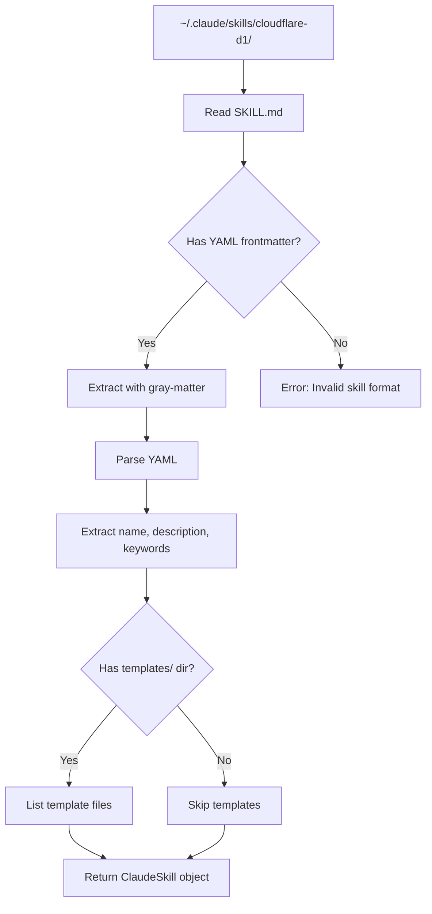
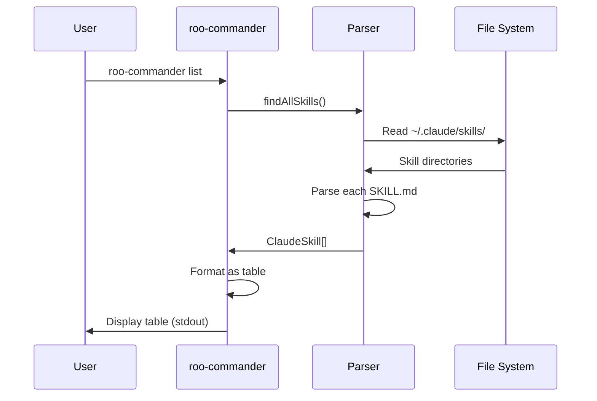
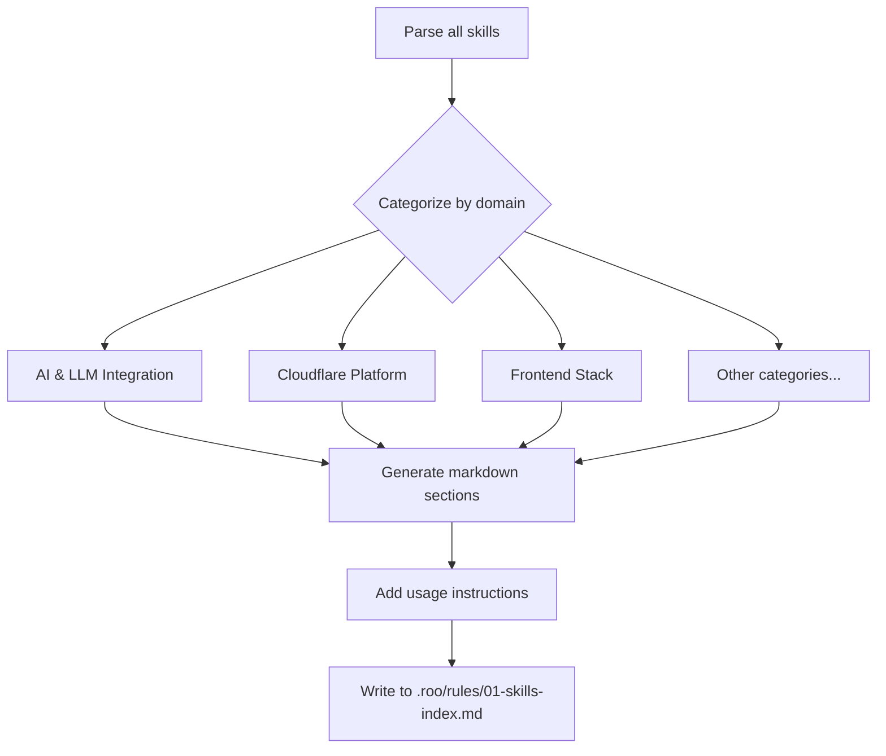
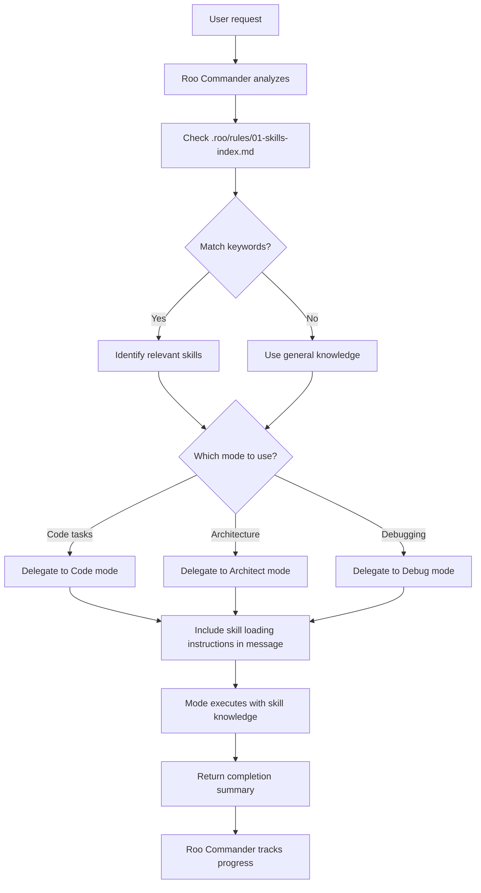
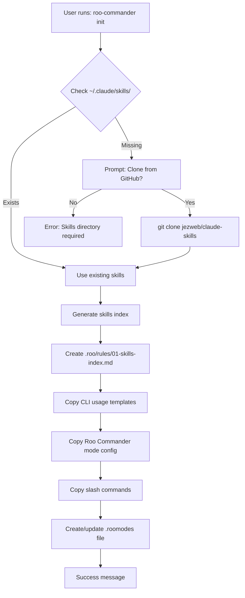
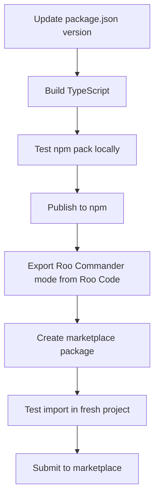

# Implementation Phases: Roo Commander v9

**Project Type**: CLI Tool + Custom Mode + Marketplace Package
**Stack**: TypeScript + Node.js (CLI), Roo Code Custom Mode System
**Estimated Total**: 28-36 hours (~28-36 minutes human time)

---

## Phase 1: CLI Project Setup

**Type**: Infrastructure
**Estimated**: 2-3 hours (~2-3 minutes human time)
**Files**: `package.json`, `tsconfig.json`, `src/index.ts`, `src/cli.ts`, `.gitignore`, `README.md`

### File Map

- `package.json` (~40 lines)
  - **Purpose**: npm package configuration
  - **Key fields**: name, version, bin, dependencies, scripts
  - **Dependencies**: commander, yaml, chalk, ora, fs-extra, gray-matter

- `tsconfig.json` (~30 lines)
  - **Purpose**: TypeScript compiler configuration
  - **Target**: ES2020, CommonJS output

- `src/index.ts` (~20 lines)
  - **Purpose**: CLI entry point
  - **Exports**: Shebang + CLI invocation

- `src/cli.ts` (~80 lines)
  - **Purpose**: Commander.js command registration
  - **Key exports**: program, command handlers

### Critical Dependencies

**External**:
- `commander` - CLI framework
- `typescript` - Language
- `@types/node` - Node.js types

**Configuration**:
- None (initial setup)

### Gotchas & Known Issues

**Bin Configuration**:
- Must include `#!/usr/bin/env node` shebang in compiled output
- `package.json` bin field must point to compiled JS, not TS
- Pattern: `"bin": { "roo-commander": "./dist/index.js" }`

**TypeScript Module Resolution**:
- Use `"moduleResolution": "node"` for Node.js compatibility
- `"module": "commonjs"` required for npm global install
- ES modules not supported for global CLIs

**npm Link Testing**:
- Must run `npm link` in project root to test locally
- Global symlink: `~/.npm-global/bin/roo-commander` → local project
- Changes require rebuild: `npm run build && npm link`

### Tasks

- [ ] Initialize npm project with `npm init`
- [ ] Set up TypeScript with tsconfig.json
- [ ] Install dependencies (commander, chalk, ora, fs-extra, gray-matter, yaml, typescript, @types/node)
- [ ] Create src/ directory structure
- [ ] Create CLI entry point with shebang
- [ ] Set up Commander.js with basic command structure
- [ ] Add build script: `tsc`
- [ ] Configure bin in package.json
- [ ] Test local installation with `npm link`
- [ ] Create .gitignore (node_modules, dist, .env)

### Verification Criteria

- [ ] `npm run build` compiles TypeScript without errors
- [ ] `npm link` creates global symlink successfully
- [ ] `roo-commander --version` shows package version
- [ ] `roo-commander --help` shows command list
- [ ] TypeScript types resolve correctly (no type errors)

### Exit Criteria

CLI scaffolding complete with TypeScript compilation working. Commands registered in Commander.js. Can run locally via `roo-commander` after npm link.

---

## Phase 2: Skill Parser

**Type**: API (internal library)
**Estimated**: 3-4 hours (~3-4 minutes human time)
**Files**: `src/parser/skill-parser.ts`, `src/parser/types.ts`, `src/parser/yaml-parser.ts`

### File Map

- `src/parser/skill-parser.ts` (~180 lines)
  - **Purpose**: Read and parse Claude Code skills from SKILL.md files
  - **Key exports**: `parseSkill(path: string)`, `findAllSkills(skillsDir: string)`
  - **Dependencies**: yaml-parser.ts, types.ts, fs-extra, path

- `src/parser/types.ts` (~100 lines)
  - **Purpose**: TypeScript interfaces for skill format
  - **Key exports**: `ClaudeSkill`, `SkillMetadata`, `SkillFrontmatter`
  - **No dependencies**: Pure type definitions

- `src/parser/yaml-parser.ts` (~80 lines)
  - **Purpose**: Extract YAML frontmatter from markdown
  - **Key exports**: `extractFrontmatter(content: string)`, `parseYaml(yaml: string)`
  - **Dependencies**: gray-matter, yaml

### Data Flow



### Critical Dependencies

**Internal**: types.ts
**External**:
- `gray-matter` - Frontmatter extraction (handles `---` delimiters)
- `yaml` - YAML parsing
- `fs-extra` - File system operations (async/await)

**Configuration**:
- Skills path: `~/.claude/skills/` (default) or custom via flag

### Gotchas & Known Issues

**YAML Frontmatter Format**:
- Must be wrapped in `---` delimiters at start of file
- Required fields: `name`, `description`
- Optional fields: `keywords`, `allowed-tools`, `version`, `license`
- Use `gray-matter` library for robust parsing (handles edge cases)

**File Not Found Handling**:
- `~/.claude/skills/` may not exist (user hasn't used Claude Code)
- Individual SKILL.md files may be missing
- Pattern: Check `fs.existsSync()` before reading, return empty array if dir missing

**Template Directory Handling**:
- Some skills have `templates/`, some don't
- Templates may be deeply nested (subdirectories)
- Pattern: Use `fs.readdirSync(path, { recursive: true })` to list all files
- Return file paths relative to skill root

**Skill Description Parsing**:
- Description may contain multi-line markdown
- May include "Use when:", "Keywords:", "Prevents:" sections
- Pattern: Extract full description as-is, don't parse subsections yet

**Keywords Extraction**:
- May be in YAML frontmatter (`keywords: [d1, database, sql]`)
- May be in description text ("Keywords: d1, database, sql")
- May be missing entirely
- Pattern: Prefer YAML field, fallback to parsing description, default to empty array

### Tasks

- [ ] Create TypeScript interfaces for Claude Code skill format
- [ ] Implement YAML frontmatter parser using gray-matter
- [ ] Implement SKILL.md content parser
- [ ] Handle templates/ directory discovery (recursive)
- [ ] Implement `parseSkill()` function for single skill
- [ ] Implement `findAllSkills()` to scan directory
- [ ] Add error handling for missing/malformed skills
- [ ] Add type guards for skill validation
- [ ] Test with 3-5 real skills from ~/.claude/skills/
- [ ] Handle edge case: missing ~/.claude/skills/ directory

### Verification Criteria

- [ ] Can parse YAML frontmatter correctly
- [ ] Extracts name, description, keywords from frontmatter
- [ ] Handles skills with templates/ directory
- [ ] Handles skills without templates/ directory
- [ ] `findAllSkills()` returns array of ClaudeSkill objects
- [ ] Returns empty array if skills directory doesn't exist
- [ ] Throws clear error on malformed YAML
- [ ] Returns proper TypeScript types (no `any`)
- [ ] Tested with at least 5 diverse skills

### Exit Criteria

Parser can read any Claude Code skill format from ~/.claude/skills/ and return structured TypeScript objects. Handles missing directories and malformed skills gracefully with clear error messages.

---

## Phase 3: CLI Commands - List & Read

**Type**: API (CLI interface)
**Estimated**: 3-4 hours (~3-4 minutes human time)
**Files**: `src/commands/list.ts`, `src/commands/read.ts`, `src/commands/search.ts`

### File Map

- `src/commands/list.ts` (~120 lines)
  - **Purpose**: Show all available skills with descriptions
  - **Usage**: `roo-commander list`
  - **Dependencies**: skill-parser, chalk (formatting)
  - **Output**: Table format with name, description, keywords

- `src/commands/read.ts` (~100 lines)
  - **Purpose**: Output skill content to stdout
  - **Usage**: `roo-commander read <skill-name>`
  - **Dependencies**: skill-parser, fs-extra
  - **Output**: Raw SKILL.md content

- `src/commands/search.ts` (~130 lines)
  - **Purpose**: Find skills by keyword matching
  - **Usage**: `roo-commander search <keyword>`
  - **Dependencies**: skill-parser, chalk
  - **Output**: Filtered skill list

### Data Flow



### Critical Dependencies

**Internal**: parser (skill-parser, types)
**External**:
- `chalk` - Terminal colors
- `cli-table3` or similar - Table formatting (install if needed)

**Configuration**:
- Skills source: `~/.claude/skills/` (default)
- Optional `--source <path>` flag for custom location

### Gotchas & Known Issues

**Missing Skills Directory**:
- If `~/.claude/skills/` doesn't exist, show helpful error
- Pattern: "Skills directory not found. Options: 1) Install Claude Code, 2) Clone github.com/jezweb/claude-skills, 3) Use --source flag"
- Don't crash, offer solutions

**Skill Name Matching**:
- User may type partial name: "cloudflare" should match "cloudflare-d1", "cloudflare-worker-base"
- User may use different case: "Cloudflare-D1" should match "cloudflare-d1"
- Pattern: Lowercase comparison, fuzzy matching (starts-with, contains)

**Large Skill Output**:
- Some SKILL.md files are 1000+ lines
- `read` command outputs to stdout (for piping)
- Don't truncate, let shell handle (user can pipe to `less`)

**Search Keyword Matching**:
- Match against: name, description, keywords array
- Case-insensitive matching
- Pattern: keyword.toLowerCase() includes searchTerm.toLowerCase()

**Progress Indicators**:
- `list` command may take 2-3 seconds for 68 skills
- Use `ora` spinner: "Loading skills..."
- Stop spinner before output

### Tasks

- [ ] Implement `list` command handler
- [ ] Format skill list as table (name, description, keywords)
- [ ] Add progress spinner for list command
- [ ] Implement `read` command handler
- [ ] Read SKILL.md content and output to stdout
- [ ] Handle skill not found error
- [ ] Implement `search` command handler
- [ ] Match keyword against name, description, keywords
- [ ] Add --source flag for custom skills directory
- [ ] Test with real skills directory
- [ ] Test error cases (missing directory, invalid skill name)

### Verification Criteria

- [ ] `roo-commander list` shows all 68 skills
- [ ] List output includes name, description, keywords
- [ ] Progress spinner shows during loading
- [ ] `roo-commander read cloudflare-d1` outputs SKILL.md content
- [ ] Read command handles skill not found gracefully
- [ ] `roo-commander search database` shows relevant skills only
- [ ] Search is case-insensitive
- [ ] --source flag works with custom directory
- [ ] Missing skills directory shows helpful error message

### Exit Criteria

All three commands (list, read, search) work correctly with proper error handling, formatted output, and user feedback via progress indicators.

---

## Phase 4: Index Generation

**Type**: API (internal library + command)
**Estimated**: 3-4 hours (~3-4 minutes human time)
**Files**: `src/generator/index-generator.ts`, `src/commands/generate-index.ts`, `src/commands/sync-index.ts`

### File Map

- `src/generator/index-generator.ts` (~200 lines)
  - **Purpose**: Generate skills index markdown from parsed skills
  - **Key exports**: `generateIndex(skills: ClaudeSkill[])`
  - **Dependencies**: types, skill categorization logic
  - **Output**: Markdown string formatted for Roo Code

- `src/commands/generate-index.ts` (~80 lines)
  - **Purpose**: CLI command to generate index
  - **Usage**: `roo-commander generate-index`
  - **Dependencies**: skill-parser, index-generator
  - **Output**: Writes to `.roo/rules/01-skills-index.md`

- `src/commands/sync-index.ts` (~100 lines)
  - **Purpose**: Update existing index
  - **Usage**: `roo-commander sync-index`
  - **Dependencies**: generate-index logic
  - **Output**: Overwrites `.roo/rules/01-skills-index.md`

### Data Flow



### Critical Dependencies

**Internal**: parser (types, skill-parser)
**External**: fs-extra (file writing)

**Configuration**:
- Output path: `.roo/rules/01-skills-index.md` (default)
- Optional `--output <path>` flag

### Gotchas & Known Issues

**Skill Categorization**:
- Need to categorize 68 skills into logical groups
- Categories: AI & LLM, Cloudflare, Frontend, Auth, Forms, State, Data, Testing, etc.
- Pattern: Use skill name prefix (cloudflare-*, openai-*, tailwind-*, etc.)
- Default category: "Other" for uncategorized skills

**Markdown Formatting**:
- Must be compatible with Roo Code's markdown parser
- Use H2 (`##`) for categories, bullet lists for skills
- Format: `- **skill-name**: Description [Keywords: keyword1, keyword2]`

**Emoji in Categories**:
- Makes index more scannable
- Pattern: ☁️ Cloudflare, 🤖 AI, ⚛️ Frontend, 🔐 Auth, etc.
- Optional but recommended

**Index File Location**:
- Must be in `.roo/rules/` (not `.roo/rules-roo-commander/`)
- Reason: ALL modes need to see skills index, not just Roo Commander
- Must create `.roo/rules/` directory if it doesn't exist

**Usage Instructions Section**:
- Include at bottom of index
- How to load a skill: Run `roo-commander read <skill-name>`
- How to list skills: Run `roo-commander list`
- When to check for skills: Before implementing from scratch

### Tasks

- [ ] Implement skill categorization logic (by name prefix)
- [ ] Create markdown template for index
- [ ] Generate category sections with emoji headers
- [ ] Format skills as bullet list with descriptions and keywords
- [ ] Add usage instructions section at bottom
- [ ] Implement `generate-index` command
- [ ] Create `.roo/rules/` directory if missing
- [ ] Write index to `.roo/rules/01-skills-index.md`
- [ ] Implement `sync-index` command (alias to generate-index)
- [ ] Test with real skills (68 skills)
- [ ] Verify markdown formatting

### Verification Criteria

- [ ] `roo-commander generate-index` creates `.roo/rules/01-skills-index.md`
- [ ] Index includes all 68 skills
- [ ] Skills are categorized logically (AI, Cloudflare, Frontend, etc.)
- [ ] Each skill has name, description, keywords
- [ ] Category headers have appropriate emoji
- [ ] Usage instructions section is clear
- [ ] Markdown is valid and readable
- [ ] `sync-index` command updates existing index
- [ ] Creates `.roo/rules/` directory if missing

### Exit Criteria

Index generation works correctly, producing well-formatted markdown file that lists all skills categorized by domain with clear usage instructions.

---

## Phase 5: Custom Instructions Templates

**Type**: Integration (template files)
**Estimated**: 2-3 hours (~2-3 minutes human time)
**Files**: `templates/rules/02-cli-usage.md`, `templates/rules/03-skill-patterns.md`

### File Map

- `templates/rules/02-cli-usage.md` (~150 lines)
  - **Purpose**: Teach ALL modes how to use roo-commander CLI
  - **Content**: Command reference, examples, when to use
  - **Used by**: All Roo modes (loaded globally)

- `templates/rules/03-skill-patterns.md` (~200 lines)
  - **Purpose**: Skill-aware development patterns
  - **Content**: When to check skills, workflow examples
  - **Used by**: All Roo modes

### Critical Dependencies

**None**: Pure markdown documentation files

**Configuration**:
- Must be placed in `.roo/rules/` (workspace-wide)
- Not `.roo/rules-roo-commander/` (mode-specific)

### Gotchas & Known Issues

**Tone and Style**:
- Write for AI agents, not humans
- Use imperative instructions: "Check for skills before implementing"
- Not conversational: "You might want to check for skills..."
- Reason: AI agents follow direct instructions better

**Command Examples**:
- Include full command syntax with flags
- Show expected output (helps AI understand success)
- Pattern: "Run `roo-commander list` → shows table of skills"

**When to Check Skills**:
- Before scaffolding new projects
- Before implementing common patterns (auth, forms, databases)
- When user mentions specific technologies (Cloudflare, Tailwind, etc.)
- NOT for trivial tasks (simple functions, utilities)

**Markdown Structure**:
- Use H1 for title, H2 for major sections
- Use code blocks for commands
- Use bullet lists for workflows
- Keep paragraphs short (2-3 sentences max)

### Tasks

- [ ] Create `02-cli-usage.md` template
- [ ] Document all CLI commands (list, read, search, generate-index, sync-index, init)
- [ ] Add command syntax and examples
- [ ] Add expected output examples
- [ ] Create `03-skill-patterns.md` template
- [ ] Document when to check for skills
- [ ] Add workflow examples (check → load → implement)
- [ ] Add anti-patterns (when NOT to use skills)
- [ ] Keep instructions concise and imperative
- [ ] Test readability (clear for AI agents)

### Verification Criteria

- [ ] CLI usage documentation covers all commands
- [ ] Examples show full command syntax
- [ ] Skill patterns document is clear and actionable
- [ ] Instructions are imperative, not conversational
- [ ] Workflows are step-by-step
- [ ] Markdown is properly formatted
- [ ] Files are under 200 lines each (concise)

### Exit Criteria

Two custom instruction templates ready for deployment. Clear, concise, imperative instructions that teach ALL Roo modes how to discover and use skills via CLI.

---

## Phase 6: Roo Commander Mode Configuration

**Type**: Integration (Roo Code mode)
**Estimated**: 4-5 hours (~4-5 minutes human time)
**Files**: `templates/.roomodes-entry.yaml`, `templates/rules-roo-commander/00-core-identity.md`, `templates/rules-roo-commander/01-orchestration.md`, `templates/rules-roo-commander/02-skill-routing.md`

### File Map

- `templates/.roomodes-entry.yaml` (~60 lines)
  - **Purpose**: Roo Commander mode configuration for .roomodes file
  - **Key fields**: slug, name, description, roleDefinition, groups, customInstructions
  - **Tool groups**: `workflow` only (new_task, attempt_completion, ask_followup_question)

- `templates/rules-roo-commander/00-core-identity.md` (~250 lines)
  - **Purpose**: Role definition and responsibilities
  - **Content**: What Roo Commander is, what it does, what it doesn't do
  - **Philosophy**: Orchestrate, don't execute

- `templates/rules-roo-commander/01-orchestration.md` (~300 lines)
  - **Purpose**: How to delegate to built-in modes
  - **Content**: new_task patterns, delegation messages, completion tracking
  - **Examples**: Delegation message templates with skill reminders

- `templates/rules-roo-commander/02-skill-routing.md` (~350 lines)
  - **Purpose**: Keyword-based skill discovery and routing
  - **Content**: Routing logic, keyword matching, multi-skill workflows
  - **Examples**: User request → skills identified → modes delegated

### Data Flow



### Critical Dependencies

**Internal**: Custom instructions (01-skills-index.md must exist)
**External**: None (pure Roo Code mode config)

**Configuration**:
- Requires `.roo/rules/01-skills-index.md` to exist (for skill routing)
- Requires `.roo/rules/02-cli-usage.md` (for CLI knowledge)

### Gotchas & Known Issues

**Tool Groups - Workflow Only**:
- Roo Commander should NOT have read/edit/command access
- Forces delegation to execution modes
- Pattern: `groups: [workflow]` only
- Reason: Orchestrator stays lightweight, avoids doing work itself

**Delegation Message Format**:
- Must include ALL required context (modes don't inherit parent context)
- Must remind mode to check skills
- Must specify clear deliverables
- Pattern: "Task: [description]\n\nBefore implementing, check skill: run `roo-commander read <skill-name>`\n\nContext: [details]\n\nExpected: [deliverables]"

**Skill Routing Keywords**:
- Need to map common terms to skills
- Example: "database" → cloudflare-d1, drizzle-orm-d1
- Example: "authentication" → better-auth, clerk-auth
- Pattern: Check multiple keywords, may match multiple skills

**Mode Selection Logic**:
- Code mode: Implementation tasks, file creation/editing
- Architect mode: Planning, reviewing, high-level design
- Debug mode: Troubleshooting, fixing errors
- Pattern: Task type determines mode, not skill type

**Context Bloat Prevention**:
- Orchestrator should NOT load full skill content
- Delegated modes load skills (keeps orchestrator light)
- Pattern: Orchestrator references skills index, delegates loading to workers

### Tasks

- [ ] Create .roomodes entry template (YAML)
- [ ] Define mode metadata (slug, name, description, emoji)
- [ ] Set tool groups to `workflow` only
- [ ] Write roleDefinition (orchestrator identity)
- [ ] Create 00-core-identity.md (what Roo Commander is)
- [ ] Document responsibilities and non-responsibilities
- [ ] Create 01-orchestration.md (how to delegate)
- [ ] Document new_task patterns
- [ ] Add delegation message templates
- [ ] Create 02-skill-routing.md (keyword matching)
- [ ] Document skill discovery workflow
- [ ] Add routing examples (request → skills → modes)
- [ ] Test YAML syntax validity
- [ ] Validate markdown formatting

### Verification Criteria

- [ ] .roomodes YAML is valid
- [ ] Mode has workflow group only (no read/edit/command)
- [ ] roleDefinition clearly defines orchestrator role
- [ ] Core identity document explains what Roo Commander does
- [ ] Orchestration document has clear delegation patterns
- [ ] Skill routing document has keyword matching logic
- [ ] All documents use imperative tone
- [ ] Examples show complete delegation messages
- [ ] Mode config references custom instructions

### Exit Criteria

Roo Commander mode fully configured with YAML entry and three rule documents. Mode is defined as lightweight orchestrator that delegates to execution modes with skill awareness.

---

## Phase 7: Slash Commands - Session Management

**Type**: Integration (Roo Code slash commands)
**Estimated**: 2-3 hours (~2-3 minutes human time)
**Files**: `templates/commands/wrap-session.md`, `templates/commands/continue-session.md`, `templates/commands/list-skills.md`, `templates/commands/load-skill.md`

### File Map

- `templates/commands/wrap-session.md` (~180 lines)
  - **Purpose**: Update SESSION.md and create git checkpoint
  - **Adapted from**: Claude Code version (remove TodoWrite skill invocation)
  - **Content**: Step-by-step SESSION.md update instructions

- `templates/commands/continue-session.md` (~120 lines)
  - **Purpose**: Resume from SESSION.md after context clear
  - **Adapted from**: Claude Code version (minimal changes)
  - **Content**: Read SESSION.md → show progress → resume from Next Action

- `templates/commands/list-skills.md` (~60 lines)
  - **Purpose**: Show available skills
  - **New command**: Specific to Roo Commander
  - **Content**: Run `roo-commander list`, format output

- `templates/commands/load-skill.md` (~80 lines)
  - **Purpose**: Load specific skill into context
  - **New command**: Specific to Roo Commander
  - **Content**: Run `roo-commander read <skill>`, parse content

### Critical Dependencies

**External**:
- roo-commander CLI (must be installed globally)
- Git (for wrap-session checkpoint)

**Configuration**:
- SESSION.md must exist (for wrap/continue commands)
- ~/.claude/skills/ or custom skills directory

### Gotchas & Known Issues

**Frontmatter Format**:
- Roo Code slash commands support optional YAML frontmatter
- Fields: `description` (shown in command menu), `argument-hint` (parameter help)
- Pattern:
  ```yaml
  ---
  description: Update SESSION.md and create git checkpoint
  argument-hint: none
  ---
  # Command content...
  ```

**Skill Invocation Removal**:
- Claude Code /wrap-session uses TodoWrite skill
- Roo Code version: Manual SESSION.md editing instructions
- Must be explicit: "Read SESSION.md → Update progress section → Update Next Action → Write file"

**Command vs Automation**:
- Roo Code commands are instruction templates, not automation
- User approval required for file changes
- Set expectations: "Follow these steps..." not "This will automatically..."

**Load Skill Pattern**:
- Command should instruct mode to run CLI, not embed skill content
- Pattern: "Run: `roo-commander read <skill-name>` → Read output → Use knowledge for implementation"
- Don't try to capture output in command file

### Tasks

- [ ] Create wrap-session.md template
- [ ] Add YAML frontmatter (description, argument-hint)
- [ ] Adapt from Claude Code version (remove skill invocations)
- [ ] Convert to manual SESSION.md update instructions
- [ ] Add git checkpoint instructions
- [ ] Create continue-session.md template
- [ ] Port from Claude Code (minimal changes needed)
- [ ] Create list-skills.md command
- [ ] Instruct mode to run `roo-commander list`
- [ ] Format output as table
- [ ] Create load-skill.md command
- [ ] Accept skill name as parameter
- [ ] Instruct mode to run `roo-commander read <skill>`
- [ ] Test command syntax and formatting

### Verification Criteria

- [ ] All commands have valid YAML frontmatter
- [ ] wrap-session provides step-by-step SESSION.md update
- [ ] continue-session reads and resumes from SESSION.md
- [ ] list-skills shows all available skills
- [ ] load-skill accepts skill name parameter
- [ ] Commands use imperative instruction style
- [ ] No skill invocations (Claude Code-specific)
- [ ] Markdown formatting is correct

### Exit Criteria

Four slash commands ready for Roo Code. Session management commands adapted from Claude Code. Skills commands provide CLI integration for listing and loading.

---

## Phase 8: Slash Commands - Planning & Release

**Type**: Integration (Roo Code slash commands)
**Estimated**: 3-4 hours (~3-4 minutes human time)
**Files**: `templates/commands/explore-idea.md`, `templates/commands/plan-project.md`, `templates/commands/plan-feature.md`, `templates/commands/github-release.md`, `templates/commands/release.md`

### File Map

- `templates/commands/explore-idea.md` (~200 lines)
  - **Purpose**: Research and validate project idea
  - **Adapted from**: Claude Code version (remove Explore subagent, AskUserQuestion)
  - **Content**: Manual research checklist

- `templates/commands/plan-project.md` (~250 lines)
  - **Purpose**: Initial project planning workflow
  - **Adapted from**: Claude Code version (remove skill invocation)
  - **Content**: Guided planning with manual doc creation

- `templates/commands/plan-feature.md` (~180 lines)
  - **Purpose**: Plan feature addition to existing project
  - **Adapted from**: Claude Code version (remove skill invocation)
  - **Content**: Feature requirements → phase creation → manual integration

- `templates/commands/github-release.md` (~150 lines)
  - **Purpose**: GitHub release workflow
  - **Adapted from**: Claude Code version (minimal changes)
  - **Content**: Tag → release notes → publish

- `templates/commands/release.md` (~120 lines)
  - **Purpose**: General release checklist
  - **Adapted from**: Claude Code version (minimal changes)
  - **Content**: Version bump → build → test → deploy

### Critical Dependencies

**External**:
- Git (for release commands)
- GitHub CLI (`gh`) or web browser (for GitHub release)

**Configuration**:
- Git repository initialized
- Remote configured for release commands

### Gotchas & Known Issues

**Planning Without Automation**:
- Claude Code uses project-planning skill (generates docs automatically)
- Roo Code version: Provide IMPLEMENTATION_PHASES.md template for manual fill-in
- Must be explicit: "Use this template structure... Fill in phases... Create file at docs/IMPLEMENTATION_PHASES.md"

**Explore Idea Without Subagent**:
- Claude Code uses Explore subagent + AskUserQuestion automation
- Roo Code version: Manual research checklist
- Pattern: List questions to research → Guide user through answers → Summarize findings

**Phase Integration (Plan Feature)**:
- Claude Code auto-inserts new phases + renumbers
- Roo Code version: Provide new phase template → instruct manual insertion → explain renumbering
- Example: "Add as Phase 4, renumber old Phase 4 → Phase 5, etc."

**Release Commands Mostly Unchanged**:
- GitHub release and general release are mostly instruction-based already
- Minimal adaptation needed
- Just add Roo Code frontmatter

### Tasks

- [ ] Create explore-idea.md template
- [ ] Remove Explore subagent references
- [ ] Convert to manual research workflow
- [ ] Add guided question framework
- [ ] Create plan-project.md template
- [ ] Remove project-planning skill invocation
- [ ] Add IMPLEMENTATION_PHASES.md template structure
- [ ] Guide manual doc creation
- [ ] Create plan-feature.md template
- [ ] Remove automatic phase insertion logic
- [ ] Add manual phase template
- [ ] Explain phase renumbering
- [ ] Create github-release.md template
- [ ] Port from Claude Code (minimal changes)
- [ ] Add Roo Code frontmatter
- [ ] Create release.md template
- [ ] Port from Claude Code (minimal changes)
- [ ] Add frontmatter
- [ ] Test all commands for clarity

### Verification Criteria

- [ ] explore-idea provides manual research framework
- [ ] plan-project includes phase template structure
- [ ] plan-feature explains manual phase integration
- [ ] github-release has complete workflow steps
- [ ] release has complete checklist
- [ ] All commands have YAML frontmatter
- [ ] No Claude Code-specific features (skills, subagents)
- [ ] Instructions are clear and actionable

### Exit Criteria

Five additional slash commands ready for Roo Code. Planning commands adapted from Claude Code with manual workflows. Release commands minimally adapted with frontmatter added.

---

## Phase 9: CLI Init Command

**Type**: Integration (CLI + templates)
**Estimated**: 4-5 hours (~4-5 minutes human time)
**Files**: `src/commands/init.ts`, `src/installer/template-installer.ts`, `src/installer/github-cloner.ts`

### File Map

- `src/commands/init.ts` (~200 lines)
  - **Purpose**: Initialize Roo Commander in project
  - **Usage**: `roo-commander init`
  - **Dependencies**: template-installer, github-cloner, skill-parser, index-generator
  - **Flow**: Check prerequisites → clone skills if needed → generate index → copy templates

- `src/installer/template-installer.ts` (~180 lines)
  - **Purpose**: Copy template files to project
  - **Key exports**: `installTemplates(projectRoot: string)`
  - **Dependencies**: fs-extra, path
  - **Copies**: .roo/rules/, .roo/rules-roo-commander/, .roo/commands/, .roomodes entry

- `src/installer/github-cloner.ts` (~120 lines)
  - **Purpose**: Clone skills from GitHub if ~/.claude/skills/ missing
  - **Key exports**: `cloneSkills(targetDir: string)`
  - **Dependencies**: child_process (git clone), ora (spinner)

### Data Flow



### Critical Dependencies

**Internal**: skill-parser, index-generator, all templates
**External**:
- `fs-extra` - File operations
- `child_process` - Git clone
- `ora` - Progress spinners
- `chalk` - Colored output

**Configuration**:
- Must be run in project root (has .git or will initialize)
- Creates .roo/ directory structure

### Gotchas & Known Issues

**Roo Code Project Detection**:
- How to detect if directory is Roo Code project?
- Pattern: Check for .roo/ directory OR prompt "Initialize Roo Code project here? (y/n)"
- If user says yes, create .roo/ directory

**Git Clone Fallback**:
- If ~/.claude/skills/ missing, offer GitHub clone
- Must ask permission first (don't auto-clone)
- Pattern: "Skills directory not found. Clone from github.com/jezweb/claude-skills to ~/.claude/skills/? (y/n)"
- Use `git clone --depth 1` for faster clone (only latest commit)

**.roomodes File Handling**:
- May already exist (user has other custom modes)
- Must merge, not overwrite
- Pattern: Read existing YAML → append Roo Commander entry → write back
- If .roomodes missing, create new file with Roo Commander entry only

**Interactive Setup**:
- Guide user through decisions (clone skills? create .roo/?)
- Use ora spinners for long operations (cloning, generating index)
- Show clear success message with next steps

**Idempotent Operation**:
- If run twice, don't break
- Check if files exist before overwriting
- Pattern: Skip if .roo/rules-roo-commander/ exists, or prompt "Reinstall? (y/n)"

### Tasks

- [ ] Implement init command handler
- [ ] Check for ~/.claude/skills/ directory
- [ ] Prompt to clone from GitHub if missing
- [ ] Implement GitHub clone function (git clone --depth 1)
- [ ] Check for .roo/ directory (Roo Code project)
- [ ] Prompt to create .roo/ if missing
- [ ] Generate skills index (call generate-index logic)
- [ ] Implement template installer
- [ ] Copy .roo/rules/ templates (01-skills-index.md, 02-cli-usage.md, 03-skill-patterns.md)
- [ ] Copy .roo/rules-roo-commander/ templates
- [ ] Copy .roo/commands/ templates (all 9 slash commands)
- [ ] Handle existing .roomodes file (merge, don't overwrite)
- [ ] Create .roomodes entry for Roo Commander
- [ ] Add progress spinners for long operations
- [ ] Show success message with next steps
- [ ] Make init idempotent (safe to run twice)
- [ ] Test with fresh project
- [ ] Test with existing .roomodes file

### Verification Criteria

- [ ] `roo-commander init` completes successfully in fresh project
- [ ] Prompts to clone skills if ~/.claude/skills/ missing
- [ ] Git clone works correctly (--depth 1 for speed)
- [ ] Creates .roo/ directory structure
- [ ] Generates .roo/rules/01-skills-index.md with all skills
- [ ] Copies .roo/rules/02-cli-usage.md and 03-skill-patterns.md
- [ ] Copies .roo/rules-roo-commander/ mode rules
- [ ] Copies all 9 .roo/commands/ slash commands
- [ ] Merges with existing .roomodes (doesn't overwrite)
- [ ] Shows progress spinners during operations
- [ ] Displays clear success message
- [ ] Safe to run twice (idempotent)

### Exit Criteria

Init command fully functional. Can set up complete Roo Commander system in fresh project with one command. Handles missing skills directory via GitHub clone. Safely merges with existing Roo Code configuration.

---

## Phase 10: Documentation & Testing

**Type**: Testing & Documentation
**Estimated**: 3-4 hours (~3-4 minutes human time)
**Files**: `README.md`, `CHANGELOG.md`, `docs/ARCHITECTURE.md`, `docs/CLI_REFERENCE.md`, `docs/MARKETPLACE.md`

### File Map

- `README.md` (~400 lines)
  - **Purpose**: Project overview, quick start, installation
  - **Audience**: Roo Code users discovering project
  - **Content**: What, why, how, examples

- `CHANGELOG.md` (~200 lines)
  - **Purpose**: Version history and changes
  - **Content**: v9.0.0 changes, breaking changes from v8.1

- `docs/ARCHITECTURE.md` (~500 lines)
  - **Purpose**: System design documentation
  - **Content**: Three-component system, data flow, integration patterns

- `docs/CLI_REFERENCE.md` (~300 lines)
  - **Purpose**: Complete CLI command reference
  - **Content**: All commands, flags, examples, output

- `docs/MARKETPLACE.md` (~200 lines)
  - **Purpose**: Marketplace submission guide
  - **Content**: Packaging, submission process, testing

### Critical Dependencies

**None**: Pure documentation files

### Gotchas & Known Issues

**README Quick Start**:
- Must be concise (users want to try it fast)
- Show 3 steps: Install CLI → Install from marketplace → Run init
- Include example workflow (user request → Roo Commander → skill loading)

**Architecture Documentation**:
- Explain three components clearly (CLI, Custom Instructions, Mode)
- Show data flow diagrams (Mermaid)
- Explain design decisions (why CLI not MCP, why global rules, etc.)

**CLI Reference Format**:
- Document each command with: Usage, Description, Flags, Examples, Output
- Show expected output (helps users understand success)
- Include troubleshooting section (common errors)

**Marketplace Guide**:
- Document packaging process (how to export mode + templates)
- Document submission process (where to submit, what to include)
- Note: This is first-time marketplace submission, may need iteration

**Testing Strategy**:
- Validation against Roo Code standards (YAML syntax, markdown format)
- Manual testing in VS Code with Roo Code extension
- Document test plan for human-in-the-loop testing

### Tasks

- [ ] Write README with quick start
- [ ] Document installation (CLI + marketplace)
- [ ] Add example workflows
- [ ] Include architecture overview
- [ ] Write CHANGELOG for v9.0.0
- [ ] Document all changes from v8.1
- [ ] Note breaking changes (complete rebuild)
- [ ] Create ARCHITECTURE.md
- [ ] Document three-component system
- [ ] Add data flow diagrams (Mermaid)
- [ ] Explain design decisions
- [ ] Create CLI_REFERENCE.md
- [ ] Document all commands with examples
- [ ] Add troubleshooting section
- [ ] Create MARKETPLACE.md
- [ ] Document packaging process
- [ ] Document submission process
- [ ] Validate YAML syntax (.roomodes entry)
- [ ] Validate markdown formatting (all templates)
- [ ] Test CLI commands with real skills directory
- [ ] Create test plan for manual testing
- [ ] Document expected outcomes for each command

### Verification Criteria

- [ ] README quick start is clear and concise
- [ ] Installation instructions are complete
- [ ] CHANGELOG documents all v9.0.0 changes
- [ ] ARCHITECTURE.md explains system design clearly
- [ ] CLI_REFERENCE.md covers all commands
- [ ] MARKETPLACE.md has packaging/submission guide
- [ ] All YAML files are syntactically valid
- [ ] All markdown files are properly formatted
- [ ] Test plan is documented and ready for execution
- [ ] Documentation is consistent across all files

### Exit Criteria

Complete documentation set ready. All YAML/markdown validated against Roo Code standards. Test plan documented for manual testing phase. Ready for marketplace packaging.

---

## Phase 11: Marketplace Packaging

**Type**: Deployment (packaging)
**Estimated**: 2-3 hours (~2-3 minutes human time)
**Files**: `package.json` (version update), `.npmignore`, `marketplace/package.json`, `marketplace/README.md`

### File Map

- `package.json` (~50 lines)
  - **Purpose**: npm package metadata
  - **Updates**: Version to 9.0.0, keywords, marketplace link

- `.npmignore` (~20 lines)
  - **Purpose**: Exclude files from npm package
  - **Content**: Exclude src/, tests/, examples/, .git/, etc.

- `marketplace/package.json` (~40 lines)
  - **Purpose**: Marketplace-specific metadata
  - **Content**: Mode name, description, author, dependencies

- `marketplace/README.md` (~150 lines)
  - **Purpose**: Marketplace listing description
  - **Content**: What it does, how to use, screenshots

### Data Flow



### Critical Dependencies

**External**:
- npm (for CLI publishing)
- Roo Code (for mode export)

**Configuration**:
- npm account (jezweb or @jezweb scope)
- Roo Code marketplace account (TBD)

### Gotchas & Known Issues

**npm Package Scope**:
- Should be scoped: `@jezweb/roo-commander`
- Reason: Prevents name collisions, shows ownership
- Requires npm organization (create if doesn't exist)

**.npmignore vs .gitignore**:
- .npmignore determines what goes in npm package
- Must exclude: src/, tests/, examples/, .github/, docs/ (except critical ones)
- Must include: dist/, templates/, README.md, LICENSE, CHANGELOG.md

**Marketplace Export**:
- Roo Code has "Export Mode" feature (one-click)
- Exports: .roomodes entry + .roo/rules-{slug}/ + dependencies
- May NOT include: CLI tool (separate install), .roo/rules/ (workspace-wide), .roo/commands/
- Solution: Document two-part install (CLI first, then marketplace mode)

**Version Number**:
- v9.0.0 (major version bump from v8.1)
- Reason: Complete rebuild, breaking changes
- Follow semantic versioning

**License**:
- MIT (matches claude-skills repository)
- Must include LICENSE file in package

### Tasks

- [ ] Update package.json version to 9.0.0
- [ ] Add keywords for npm discoverability
- [ ] Create .npmignore file
- [ ] Exclude src/, tests/, examples/, etc.
- [ ] Include dist/, templates/, README.md, LICENSE, CHANGELOG.md
- [ ] Run `npm run build` (compile TypeScript)
- [ ] Test package locally with `npm pack`
- [ ] Extract .tgz and verify contents
- [ ] Publish to npm: `npm publish --access public` (if scoped)
- [ ] Verify npm page: https://npmjs.com/package/@jezweb/roo-commander
- [ ] Export Roo Commander mode from Roo Code
- [ ] Test mode import in fresh Roo Code project
- [ ] Create marketplace package.json
- [ ] Write marketplace README (description, screenshots)
- [ ] Prepare marketplace submission materials
- [ ] Document installation process (CLI + marketplace)

### Verification Criteria

- [ ] `npm pack` creates valid .tgz package
- [ ] Package contents include dist/, templates/, README.md
- [ ] Package excludes src/, tests/, node_modules/
- [ ] Published to npm successfully
- [ ] `npm install -g @jezweb/roo-commander` works
- [ ] `roo-commander --version` shows 9.0.0
- [ ] Mode exports from Roo Code successfully
- [ ] Mode imports in fresh project successfully
- [ ] Marketplace README is clear and complete
- [ ] Two-part installation process documented

### Exit Criteria

CLI published to npm as @jezweb/roo-commander@9.0.0. Roo Commander mode exported and tested. Marketplace submission materials ready. Installation process documented and tested.

---

## Phase 12: Release & Community

**Type**: Deployment (launch)
**Estimated**: 1-2 hours (~1-2 minutes human time)
**Files**: GitHub release, Reddit post

### Tasks

- [ ] Create GitHub release for v9.0.0
- [ ] Write release notes (copy from CHANGELOG.md)
- [ ] Tag commit: `git tag v9.0.0 && git push --tags`
- [ ] Attach assets if needed (none required)
- [ ] Merge v9 branch to main
- [ ] Update main branch on GitHub
- [ ] Submit Roo Commander to Roo Code marketplace
- [ ] Write Reddit post for r/RooCode
- [ ] Explain problem it solves (skills for Roo Code)
- [ ] Link to GitHub repo and npm package
- [ ] Include example workflow
- [ ] Respond to comments and questions
- [ ] Monitor for issues in first 24 hours
- [ ] Create GitHub issues for any bugs reported

### Verification Criteria

- [ ] GitHub release published with v9.0.0 tag
- [ ] Main branch updated from v9
- [ ] Marketplace submission accepted
- [ ] Reddit post published on r/RooCode
- [ ] Post includes clear description and links
- [ ] No critical bugs reported in first 24 hours
- [ ] Community engagement positive (upvotes, comments)

### Exit Criteria

Roo Commander v9 released to community. Published on npm, GitHub, and Roo Code marketplace. Announced on r/RooCode. Responding to community feedback and issues.

---

## Summary

**Total Phases**: 12
**Estimated Duration**: 28-36 hours (~28-36 minutes human time)
**Deployment Strategy**: Publish CLI to npm after Phase 11, submit to marketplace, announce to community in Phase 12

### Phase Breakdown

- **Infrastructure** (Phase 1): CLI project setup
- **API** (Phases 2-4): Skill parsing, commands, index generation
- **Integration** (Phases 5-9): Templates, mode config, slash commands, init command
- **Testing** (Phase 10): Documentation & validation
- **Deployment** (Phases 11-12): Packaging & release

### Key Milestones

- **Phase 3 Complete**: CLI commands functional (list, read, search)
- **Phase 6 Complete**: Roo Commander mode configured
- **Phase 9 Complete**: Full system deployable via `init`
- **Phase 11 Complete**: Published to npm and marketplace ready
- **Phase 12 Complete**: Released to community

### Context Management

Each phase sized to fit in single session (2-4 hours estimated, ~2-4 minutes human time). Phase dependencies minimal. Can resume easily after context clear by reading IMPLEMENTATION_PHASES.md + SESSION.md.

### Testing Strategy

- **Per-phase validation**: Verify functionality against Roo Code standards
- **Human-in-the-loop testing**: Manual testing in VS Code with Roo Code extension after Phase 10
- **Integration testing**: Full workflow test (install CLI → run init → use Roo Commander mode) before Phase 12 release

---

**Next Steps**: Create SESSION.md to track progress through these phases. Start Phase 1: CLI Project Setup.